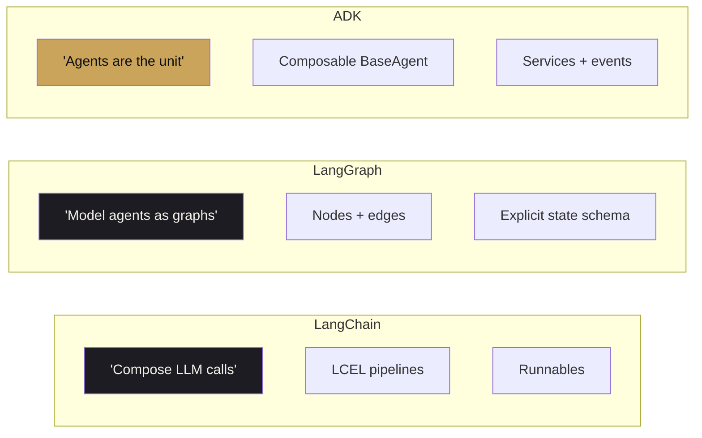

# ADK vs LangChain and LangGraph

<span class="kicker">chapter 00 · page 3 of 4</span>

A fair comparison. All three are actively maintained and have
thousands of production users. The question is not *which is best in
the abstract* — it is *which is best for the system you are trying to
build.*

---

## Three frameworks, three starting premises



- **LangChain** started as a toolkit for composing LLM calls into
  pipelines. LCEL (the expression language) and `Runnable` are the
  core primitives. Fast to prototype, huge ecosystem of integrations.
- **LangGraph** started as LangChain's answer to "my agent needs
  loops, branches, and persistent state." It models agents as
  graphs — nodes do work, edges decide what happens next, and state
  is an explicit typed schema.
- **ADK** started as Google's internal framework for the agents it
  ships itself. The unit is the agent; composition is done by
  nesting agents of different types; services (session, memory,
  artifact) are pluggable.

None of these is a straightforward replacement for the others. They
answer different questions.

---

## Head-to-head by operation

The table is the useful view. The axes are the things you actually
care about in a production system.

| Operation | LangChain | LangGraph | ADK |
|---|---|---|---|
| Hello-world | 4 lines | 15 lines | 8 lines |
| Multi-step workflow | `pipe` operators on LCEL | Graph with explicit nodes/edges | Nested workflow agents |
| Conditional branching | Runnable branches | First-class edges | `before_agent_callback` + `actions.transfer_to_agent` |
| Persistent session | User provides it | Checkpointer interface | `SessionService` (built-in Vertex, DB, in-memory) |
| Long-term memory | User provides it | User provides it | `MemoryService` (built-in Vertex Memory Bank) |
| Human-in-the-loop | Pattern (interrupt) | First-class (`interrupt`) | `LongRunningFunctionTool` + callbacks |
| Voice / live audio | Not in core | Not in core | `runner.run_live()` + Gemini Live |
| Computer use | Via community tools | Via community tools | `ComputerUseToolset` + Gemini computer-use |
| Multi-agent federation | Agents-as-tools | Sub-graphs | `RemoteA2aAgent` over A2A protocol |
| MCP | `langchain-mcp` adapter | Same adapter | `MCPToolset` (stdio, SSE, streamable HTTP) |
| Evaluation | LangSmith (paid/SaaS) | LangSmith | `adk eval` + programmatic `AgentEvaluator` |
| Deployment target | DIY | LangGraph Platform (paid) | Vertex Agent Engine, Cloud Run, GKE, DIY |
| Tracing | LangSmith | LangSmith | OpenTelemetry, any OTLP backend |
| Vendor lock-in signal | Heavy (LangSmith centric) | Heavy (Platform centric) | Light (A2A/MCP open protocols, OTel open) |

The two rows that do the most work in that table: **voice/computer
use** (ADK uniquely integrated) and **deployment/eval** (ADK has GCP
as a native target; LangGraph has its own cloud).

---

## A 20-line comparison

The same agent, three ways. A dice-roller that uses two tools.

=== "LangChain (v0.3)"

    ```python
    from langchain_core.tools import tool
    from langchain_google_genai import ChatGoogleGenerativeAI
    from langchain.agents import create_tool_calling_agent, AgentExecutor
    from langchain.prompts import ChatPromptTemplate

    @tool
    def roll_die(sides: int) -> int:
        import random; return random.randint(1, sides)

    @tool
    def check_prime(n: int) -> bool:
        return n > 1 and all(n % i for i in range(2, int(n**0.5) + 1))

    llm = ChatGoogleGenerativeAI(model="gemini-3-flash-preview")
    prompt = ChatPromptTemplate.from_messages([
        ("system", "Roll and explain."),
        ("user", "{input}"), ("placeholder", "{agent_scratchpad}")])
    agent = create_tool_calling_agent(llm, [roll_die, check_prime], prompt)
    exec = AgentExecutor(agent=agent, tools=[roll_die, check_prime])
    print(exec.invoke({"input": "Roll a d20 and say if it's prime."}))
    ```

=== "LangGraph (v0.4)"

    ```python
    from typing import Annotated, TypedDict
    from langgraph.graph import StateGraph, END
    from langgraph.prebuilt import ToolNode
    from langchain_google_genai import ChatGoogleGenerativeAI

    def roll_die(sides: int) -> int:
        import random; return random.randint(1, sides)
    def check_prime(n: int) -> bool:
        return n > 1 and all(n % i for i in range(2, int(n**0.5) + 1))

    class S(TypedDict): messages: Annotated[list, "append"]

    model = ChatGoogleGenerativeAI(model="gemini-3-flash-preview").bind_tools(
        [roll_die, check_prime])
    def agent(s): return {"messages": [model.invoke(s["messages"])]}
    def cont(s):  return "tools" if s["messages"][-1].tool_calls else END

    g = StateGraph(S)
    g.add_node("agent", agent)
    g.add_node("tools", ToolNode([roll_die, check_prime]))
    g.set_entry_point("agent"); g.add_conditional_edges("agent", cont)
    g.add_edge("tools", "agent")
    app = g.compile()
    print(app.invoke({"messages": [("user", "Roll a d20 and say if prime.")]}))
    ```

=== "ADK (v1.31)"

    ```python
    from google.adk.agents import LlmAgent
    from google.adk.runners import InMemoryRunner
    from google.genai import types

    def roll_die(sides: int) -> int:
        import random; return random.randint(1, sides)
    def check_prime(n: int) -> bool:
        return n > 1 and all(n % i for i in range(2, int(n**0.5) + 1))

    root = LlmAgent(name="roller", model="gemini-3-flash-preview",
                    tools=[roll_die, check_prime])
    runner = InMemoryRunner(agent=root, app_name="demo")
    sess = await runner.session_service.create_session(
        app_name="demo", user_id="u")
    async for e in runner.run_async(
        user_id="u", session_id=sess.id,
        new_message=types.Content(role="user", parts=[
            types.Part(text="Roll a d20 and say if it's prime.")])):
        print(e)
    ```

Three observations from those three snippets:

1. **LangChain wins on line count** for a narrow tool-calling agent.
   This is its sweet spot.
2. **LangGraph makes state explicit** — you declare the schema. For a
   system with complex branching, that is a real advantage. For a
   chat-style workflow it is overhead.
3. **ADK has the longest hello-world but the shallowest migration
   slope.** The same `root` variable, wrapped in a different runner
   and services, runs on Agent Engine. The other two need a web
   framework and a checkpointer to get there.

---

## Where LangChain wins

- Retrieval pipelines. The ecosystem around loaders, splitters, and
  vector stores is genuinely best-in-class.
- Rapid prototyping of single-shot chains. LCEL is terse and legible
  for the "fetch + prompt + parse" case.
- Ecosystem breadth. More community integrations exist than for any
  other framework.

If your project is *"classify an email, pull a template, call an API,
format the response"*, LangChain is the shortest path.

## Where LangGraph wins

- Deterministic, auditable workflows with non-trivial branching.
- Use cases where state is the dominant abstraction — your team thinks
  in terms of a schema that evolves turn over turn.
- Applications using LangSmith for eval and tracing.

If your project is *"a stateful workflow agent with clear branching
and a typed state schema"*, LangGraph is cleaner than either
alternative.

## Where ADK wins

- Production Google Cloud deployments (Agent Engine is native).
- Voice / multimodal / real-time bidirectional (no other framework has
  equivalent first-class primitives).
- Computer use (only Gemini has a production computer-use model and
  ADK is the integration).
- Multi-agent federation across process and team boundaries (A2A).
- Systems where the agent runtime is shared infrastructure — several
  teams shipping agents that need isolation, quotas, auditing, and a
  uniform deployment story.
- Evaluation without a SaaS dependency.

If your project is *"an agent platform for a company that already runs
on GCP, with voice, evaluation, and federation as requirements"* —
ADK is the answer the whole framework was designed for.

---

## On the common claim that "frameworks are all the same now"

They are not. The differences compound at scale:

- A retrieval-heavy demo in LangChain and the same demo in ADK look
  similar. The *production version* diverges: ADK's event log and
  session services cut the bespoke plumbing in half.
- A multi-step workflow in LangGraph and the same workflow as nested
  ADK agents look similar. The *second agent* diverges: A2A makes the
  cross-agent case trivial, and there is no LangGraph equivalent that
  is open and in-process agnostic.
- A voice agent in LangGraph is mostly glue code around Gemini Live.
  In ADK it is a `run_live()` call on the same agent.

That said, **interop is possible**. The `langchain_structured_tool_agent`
and `langchain_youtube_search_agent` samples in `adk-python` show
LangChain tools running inside ADK agents. The [Interop chapter](../16-interop/index.md)
covers the practical recipes.

---

## Decision rules of thumb

If only one condition is true, use the framework on the right:

| If | Then |
|---|---|
| Single-shot chain with retrieval | LangChain |
| Workflow with typed state schema and branching | LangGraph |
| Multi-team agent platform on GCP | ADK |
| Voice, live audio, or computer-use requirement | ADK |
| Strict local-only, no-cloud requirement | LangGraph (+ its checkpointers) or ADK self-hosted |
| Already using Vertex for inference | ADK |
| Already using LangSmith for evaluation | LangGraph |
| Budget-constrained prototype | LangChain |

If multiple conditions are true, the ones further down the table tend
to dominate. Production requirements beat ergonomics.

---

## Where to go next

- [Choosing the right framework](choosing-the-right-framework.md) — a
  one-page decision tree.
- [Chapter 16 — Interop](../16-interop/index.md) — running LangChain
  tools inside ADK, and vice versa.
- [Chapter 17 — Comparisons](../17-comparisons/index.md) — deeper
  feature-by-feature comparisons including CrewAI and AutoGen.

---

### Sources

- LangChain docs, v0.3 API.
- LangGraph docs, v0.4 API.
- `google/adk-python` 1.31.1 samples (`langchain_structured_tool_agent`,
  `hello_world`, `simple_sequential_agent`, `a2a_basic`).
