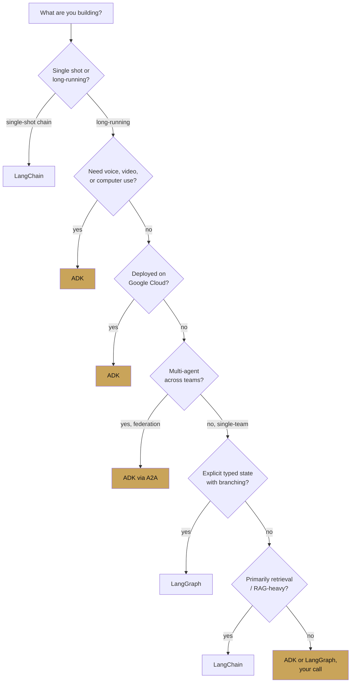

# Choosing the right framework

chapter 00 · page 4 of 4

A decision guide, not a recommendation. ADK is the right answer for
a specific shape of project. This page tells you which one.

---

## The one-question test

> *Is the agent **the product**, or is the agent **part of a
> platform**?*

If the agent is the product — a single bot, a specific workflow, a
narrow demo — almost any framework will work and you should pick on
ergonomic taste.

If the agent is part of a platform — many agents, many teams,
production traffic, evaluation gates, voice or computer use,
cross-framework federation — the answer is ADK. The rest of this
cookbook is written for that case.

---

## A longer decision tree

---

## Signals that push you toward ADK

If any three of these are true, read the rest of the cookbook.

- [ ] We will run more than one agent in production.
- [ ] We want evaluation in CI, not a dashboard tab.
- [ ] Voice or real-time is on the roadmap (even "someday").
- [ ] We are on Google Cloud, or open to being on Google Cloud.
- [ ] Another team at our company is building agents too.
- [ ] We need pluggable session and memory backends (our own database).
- [ ] We will integrate with MCP servers.
- [ ] Some agent actions need human approval.
- [ ] We want to migrate from a chain library in 6–12 months.
- [ ] We care about the deployment story more than the inner-loop DX.

## Signals that push you away from ADK

Also honest. If these dominate, use something else.

- [ ] We are strictly local, air-gapped, no cloud, no Google.
- [ ] Our team does not use Python (though TypeScript, Go, and Java
      versions exist, they lag Python for features).
- [ ] We need the existing LangSmith eval and we are not moving.
- [ ] The agent is a one-shot retrieval pipeline with no multi-turn.
- [ ] We have a hard requirement on OpenAI models only and no
      willingness to use `LiteLlm`.

## Signals that mean "use the right tool for the job, and bridge"

These are common, and the interop chapter covers them:

- [ ] We already have LangChain tools we love → wrap them with
      `LangchainTool`.
- [ ] We already have CrewAI agents → expose them over A2A and
      consume them in ADK as `RemoteA2aAgent`.
- [ ] We have an MCP server → use `MCPToolset`.
- [ ] We have a FastAPI service → mount ADK at `/agent` and keep the
      rest of the app.

ADK is designed to be composable with the other frameworks, not an
either/or.

---

## The sunk-cost question

If your team has already shipped a LangChain or LangGraph agent, the
decision is not *rewrite or stay*. The migration is almost always
incremental:

1. **Embed first.** Wrap your existing agent as an A2A service and
   consume it from ADK. Your team keeps shipping on the old stack,
   the platform team runs the orchestration.
2. **Replace by capability.** Rewrite the agents that need voice,
   computer use, or Vertex-native memory first. Leave retrieval-only
   chains in place.
3. **Replace the runtime, keep the logic.** The function bodies of
   most LangChain tools port to ADK in an afternoon. What takes
   longer is the session/memory/observability surface — which is
   exactly where ADK pays you back.

Nothing in this cookbook suggests you should stop everything and
rewrite. The value of ADK shows up in the second year.

---

## A reader's self-check

Before going to Chapter 1, test the mental model. Answer these from
memory, with the understanding that you may not have all the detail
yet — "roughly right" is the goal.

1. Name the ten primitives.
2. What is the difference between a `Session` and `Memory`?
3. Which agent type runs its sub-agents concurrently?
4. What does `before_tool_callback` return to block a tool call?
5. Which runner method drives bidirectional audio?
6. What protocol lets an ADK agent call an agent written in another
   framework?
7. Which Gemini model ID is used for computer use, as of April 2026?
8. What kind of tool pauses while a human decides?

If five or more of those have clear answers in your head, skip to
[Chapter 2](../02-core-concepts/index.md). If not,
[Chapter 1](../01-getting-started/index.md) will fill the gaps.

Answers, in order: *(1) Agent, Tool, Runner, Session, Memory,
Artifact, Event, Callback, Plugin, Skill. (2) Session is
within-conversation state; Memory persists across sessions.
(3) `ParallelAgent`. (4) A non-None value — usually a dict describing
the blocked result. (5) `runner.run_live()`. (6) A2A via
`RemoteA2aAgent` and agent cards. (7)
`gemini-2.5-computer-use-preview-10-2025`. (8) A
`LongRunningFunctionTool`.*

---

## Where to go next

You are done with Chapter 0.

- [Chapter 1 — Getting started](../01-getting-started/index.md) —
  install and run a first agent.
- [Chapter 2 — Core concepts](../02-core-concepts/index.md) — the
  primitives, one page each.
- [Chapter 19 — ADK as a harness platform](../19-harness-platform/index.md)
  — the chapter written for harness builders who skipped ahead.
