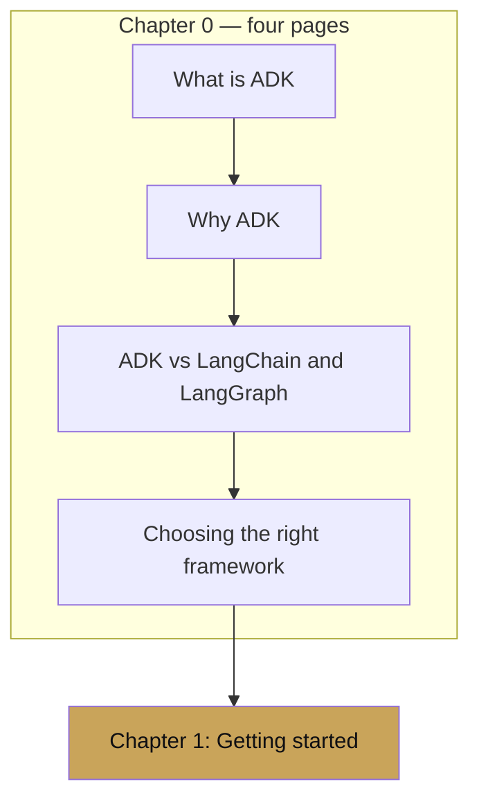

# Chapter 0 — Introduction

chapter 00 · orientation

Before we install anything, this chapter answers the only three
questions that matter at the start of an agent project:

1. What is ADK, structurally?
2. Why was it built, and who is it for?
3. How does it compare to the frameworks you already know?

If the answers in this chapter map to the kind of system you are
planning, the rest of the cookbook is worth your time. If they do not,
you will still understand why — which is the second-best outcome.

---

## Reading map

- [What is ADK](what-is-adk.md) — the ten primitives and how they fit.
- [Why ADK](why-adk.md) — the design decisions, in the language of
  harness builders.
- [ADK vs LangChain and LangGraph](adk-vs-langchain-langgraph.md) — a
  head-to-head on the operations that matter in production.
- [Choosing the right framework](choosing-the-right-framework.md) — a
  short decision guide. ADK does not win every battle; this page says
  which ones.

---

## A note on audience

This cookbook is written with two readers in mind:

- **The orchestration builder** — the engineer designing a system that
  will *run* other agents, route between them, persist their state,
  evaluate their outputs, and deploy them. For this reader, ADK is a
  platform. The interesting chapters are 2 (core concepts), 9
  (multi-agent), 10 (memory), 13 (deployment), and 19 (ADK as a harness
  platform).
- **The application developer** — the engineer building one or two
  specific agents that will be embedded in a product. For this reader,
  ADK is a framework. The interesting chapters are 1, 3, 4, 5, 6, 7, 8
  and the `examples/` directory.

Both paths are first-class. Nothing in this cookbook assumes you are
one rather than the other. But if you *are* building a harness — the
kind of system that is itself the runtime for other agents — read the
why chapter carefully. It was written for you.
