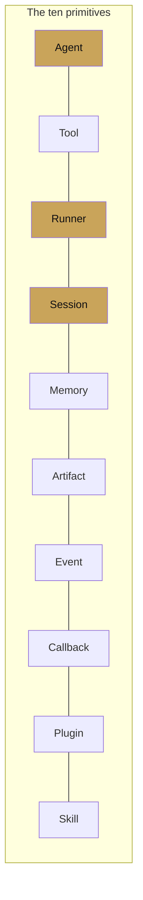
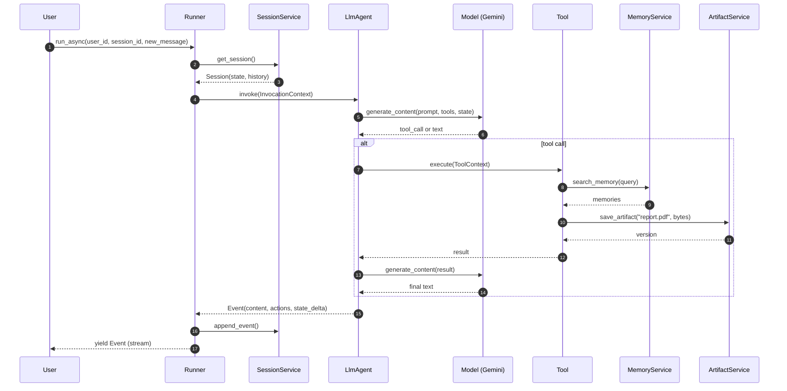

# What is ADK

<span class="kicker">chapter 00 · page 1 of 4</span>

The Agent Development Kit is Google's open-source framework for
building, evaluating, and deploying AI agents. It is the same framework
that underpins several of Google's own agent products — including parts
of Gemini Enterprise, the managed Vertex AI Agent Engine runtime, and
the public computer-use preview — so what you are reading in the
`google/adk-python` repo is not a demo of a product: it *is* the
product, minus the hosting.

This page covers the ten primitives, in the order they will appear in
almost every project you build with ADK.

---

## The ten primitives, at a glance



Every ADK program you write is a permutation of these ten concepts.
Reading them in one sitting is the fastest way to internalise the
mental model, and the rest of the cookbook assumes you have.

| # | Primitive | One-line summary | Package |
|---|---|---|---|
| 1 | Agent | A unit of behaviour: either an `LlmAgent` or a workflow orchestrator. | `google.adk.agents` |
| 2 | Tool | A callable the agent may use — function, OpenAPI spec, MCP server, or another agent. | `google.adk.tools` |
| 3 | Runner | The loop that drives an agent from a user message to a stream of events. | `google.adk.runners` |
| 4 | Session | One conversation's state — history, scratchpad, turn counter. | `google.adk.sessions` |
| 5 | Memory | Long-term knowledge that persists across sessions. | `google.adk.memory` |
| 6 | Artifact | Binary or large payload storage — files, images, PDFs, tool outputs. | `google.adk.artifacts` |
| 7 | Event | The canonical record of everything that happens during a run. | `google.adk.events` |
| 8 | Callback | Typed hook points: `before_agent`, `before_tool`, `before_model`, and their `after_*` twins. | kwargs on agents |
| 9 | Plugin | Cross-cutting runtime extensions attached to the `Runner`. | `google.adk.plugins` |
| 10 | Skill | Packaged instructions + resources + scripts, per the Agent Skill spec. | `google.adk.skills` |

---

## How they fit together

The diagram below is the single most useful picture in the cookbook.
Once you can read it without glancing at the legend, you are more than
halfway there.



Notice the two things ADK gets to own, where other frameworks hand the
problem to the user:

1. **Session state is the runtime's job.** You do not keep a
   `history[]` somewhere and remember to pass it to the model on every
   call. The `SessionService` does that, and the agent simply reads
   from `context.state`.
2. **Events are structured, not strings.** Every turn produces an
   `Event` with `content`, `actions`, and a `state_delta`. Tracing,
   replaying, rewinding, evaluating — they are all manipulations of
   the event stream. There is no separate "telemetry" layer.

---

## Primitive 1 — Agent

```python
from google.adk.agents import LlmAgent

root = LlmAgent(
    name="weather_agent",
    model="gemini-3-flash-preview",
    description="Answers weather questions for a city.",
    instruction="You are a concise weather assistant. Use the get_weather tool.",
    tools=[get_weather],
)
```

`LlmAgent` (exported from the top level as `Agent`) is the model-backed
worker. `SequentialAgent`, `ParallelAgent`, and `LoopAgent` are the
workflow orchestrators. All four share the `BaseAgent` interface, which
is how you can nest them:

```python
from google.adk.agents import SequentialAgent, ParallelAgent, LoopAgent

pipeline = SequentialAgent(
    name="report_pipeline",
    sub_agents=[
        ParallelAgent(name="gather", sub_agents=[web_searcher, kb_searcher]),
        LoopAgent(name="refiner", sub_agent=drafter, max_iterations=3),
        reviewer,
    ],
)
```

The nesting reads the way you would draw it. That is not an accident —
the `BaseAgent` abstraction is designed so workflow agents and LLM
agents are interchangeable wherever the type signature calls for an
`Agent`.

## Primitive 2 — Tool

A tool is anything the agent can call. In increasing order of
complexity:

```python
# Function tool — Python callable, type hints and docstring become the schema.
def get_weather(city: str) -> dict:
    """Return the current weather for `city`."""
    ...

# Long-running tool — the agent can do other work while this awaits a human.
from google.adk.tools.long_running_tool import LongRunningFunctionTool
hitl = LongRunningFunctionTool(func=ask_for_approval)

# MCP tool — any server that speaks the Model Context Protocol.
from google.adk.tools.mcp_tool.mcp_toolset import MCPToolset, StdioServerParameters
notion = MCPToolset(connection_params=StdioServerParameters(
    command="npx", args=["-y", "@notionhq/notion-mcp-server"]))

# OpenAPI tool — a REST API described by an OpenAPI spec.
from google.adk.tools.openapi_tool.openapi_spec_parser import OpenApiTool
api = OpenApiTool(spec_path="./billing.yaml")

# Agent-as-tool — another ADK agent wrapped as a callable.
from google.adk.tools.agent_tool import AgentTool
translator_tool = AgentTool(agent=translator_agent)
```

## Primitive 3 — Runner

The runner is the loop. You pick a runner and give it an agent plus the
services the agent needs.

```python
from google.adk.runners import InMemoryRunner
from google.genai import types

runner = InMemoryRunner(agent=root, app_name="weather")
session = await runner.session_service.create_session(
    app_name="weather", user_id="u1")

async for event in runner.run_async(
    user_id="u1",
    session_id=session.id,
    new_message=types.Content(
        role="user",
        parts=[types.Part(text="What's the weather in Seattle?")])):
    print(event)
```

`InMemoryRunner` is the dev default — all four services (session,
memory, artifact, credential) are in-process. For production you swap
in `VertexAiSessionService`, `VertexAiMemoryBankService`, and the
`VertexAiArtifactService`, or any implementation of the base interfaces
you write yourself.

## Primitive 4 — Session

A session is a conversation. It holds `history` (turns), `state` (a
dict the agent can read and write), and metadata.

```python
session = await runner.session_service.get_session(
    app_name="weather", user_id="u1", session_id=sid)
print(session.state.get("last_city"))
```

State keys have conventional prefixes:

- `user:` — persists across sessions for the same user.
- `app:` — persists across all sessions of the app.
- `temp:` — scoped to the current invocation only.
- no prefix — scoped to this session.

## Primitive 5 — Memory

Memory is cross-session knowledge. Two built-in services:

```python
from google.adk.memory import InMemoryMemoryService, VertexAiMemoryBankService

dev_memory = InMemoryMemoryService()

prod_memory = VertexAiMemoryBankService(
    project="my-project",
    location="us-central1",
    agent_engine_id="1234567890")
```

Agents reach memory either on-demand (`load_memory_tool`) or
eagerly (`preload_memory_tool`). Chapter 10 goes into the trade-offs.

## Primitive 6 — Artifact

Artifacts are where large things live — PDFs, images, generated code,
audio clips. The tool-level API is three calls:

```python
tool_context.save_artifact("report.pdf", pdf_part)
loaded = tool_context.load_artifact("report.pdf")
names  = tool_context.list_artifacts()
```

## Primitive 7 — Event

Every run yields an `Event` stream. Events are the trace, the
replay, and the telemetry — all at once.

```python
async for event in runner.run_async(...):
    if event.content and event.content.parts:
        for part in event.content.parts:
            if part.text:
                print(part.text, end="", flush=True)
    if event.actions.state_delta:
        print("state changed:", event.actions.state_delta)
```

## Primitive 8 — Callback

Callbacks are the framework's typed hooks. They run before and after
each agent, tool, and model call.

```python
def before_tool(tool, args, tool_context):
    if tool.name == "delete_account":
        return {"blocked": True, "reason": "irreversible action"}

root = LlmAgent(
    name="root", model="gemini-3-flash-preview",
    tools=[delete_account],
    before_tool_callback=before_tool,
)
```

Returning a value from a `before_*` callback short-circuits the
underlying call — which is how you implement safety, caching, and
policy layers without writing a separate proxy.

## Primitive 9 — Plugin

Plugins are runner-scoped extensions. A plugin sees every event in the
runtime, which makes them the right place for observability, retries,
and cross-cutting policy.

```python
from google.adk.runners import InMemoryRunner

runner = InMemoryRunner(
    agent=root,
    plugins=[TracingPlugin(), ToolRetryPlugin(max_attempts=3)],
)
```

## Primitive 10 — Skill

Skills package instructions, references, and scripts into a self-contained
directory that agents load on demand. The format is the Agent Skill
specification (`SKILL.md` frontmatter + body + `references/` +
`scripts/`), and ADK loads them through a `SkillToolset`.

```python
from google.adk.skills import load_skill_from_dir
from google.adk.tools.skill_toolset import SkillToolset

weather = load_skill_from_dir("./skills/weather")
root = LlmAgent(
    name="assistant",
    model="gemini-3.1-pro-preview",
    tools=[SkillToolset(skills=[weather])],
)
```

Skills are how you keep an agent's effective surface area manageable.
The model only pulls the body of a skill into context when the metadata
line tells it the skill is relevant — the rest stays off-context until
needed.

---

## What ADK does *not* ship with opinions about

It helps to say this out loud, because it is where ADK differs from
LangChain's prescriptive "LCEL" philosophy:

- **No canonical vector store.** You plug in RAG through a tool. See
  the `rag_agent` sample and `VertexAiRagRetrieval`.
- **No prescribed prompt templates.** Instructions are plain strings
  (or callables via `instruction_provider`). If you want a Jinja layer,
  you add it.
- **No chain-composition DSL.** Orchestration is done by nesting
  agents, not by piping strings through `|` operators.
- **No opinion about where you deploy.** Agent Engine is recommended;
  Cloud Run, GKE, and self-hosted all work.

The upshot: ADK is more of a *platform* than a *chain library*. If you
are building a harness — a thing that will run other agents — that is
the right shape. The next page, [Why ADK](why-adk.md), spells out the
design decisions that produced it.

---

## Where to go next

- [Why ADK](why-adk.md) — the design decisions behind the ten
  primitives.
- [Chapter 2 — Core concepts](../02-core-concepts/index.md) — each
  primitive gets its own page.
- [Chapter 1 — Getting started](../01-getting-started/index.md) — if
  you would rather type than read.

---

### Sources

- [`adk.dev/agents`](https://adk.dev/agents/) — agent types.
- [`adk.dev/skills`](https://adk.dev/skills/) — the Agent Skill spec.
- [`github.com/google/adk-python`](https://github.com/google/adk-python)
  — `src/google/adk/` package layout as of 1.31.1.
