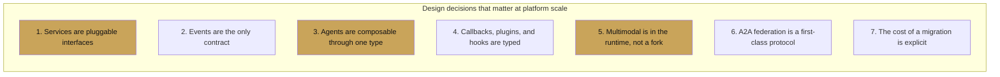

# Why ADK

<span class="kicker">chapter 00 · page 2 of 4</span>

This page is the opinionated one. If you have read [What is ADK](what-is-adk.md)
and the question you are asking is *"why would I pick this over the
framework I already know?"* — these are the answers, in the vocabulary
of someone who is building orchestration rather than prototyping a demo.

---

## The one-sentence version

**ADK is a platform for building agents, not a library for chaining
LLM calls.** Every design decision in the framework flows from that
distinction.

Chain libraries (LangChain, LlamaIndex's query engines, CrewAI's
process model) optimise for the inner-loop experience: how few lines
of code does it take to get a working demo? They win on that axis, and
if your project is going to stay at that scale, they are the right
choice.

Orchestration platforms (ADK, Vertex AI Agent Engine, the newer
Temporal-flavoured agent platforms) optimise for the outer loop: what
does it take to run agents as long-lived, multi-tenant, evaluable
services that hand off to humans, stream voice, delegate to other
agents, and survive deployment? They pay a small complexity tax up
front in exchange for not having to rewrite the runtime a quarter in.

The rest of this page is the list of design decisions that put ADK
squarely in the second camp.

---

## Seven design decisions



### 1. Services are pluggable interfaces

The runner takes five services: `SessionService`, `MemoryService`,
`ArtifactService`, `CredentialService`, and (optionally) a code
executor. Each is a Python interface you can implement.

```python
from google.adk.sessions import BaseSessionService
from google.adk.runners import Runner

class MySessionService(BaseSessionService):
    async def create_session(self, *, app_name, user_id, ...): ...
    async def get_session(self, *, app_name, user_id, session_id): ...
    async def list_sessions(self, *, app_name, user_id): ...
    async def append_event(self, session, event): ...
    async def delete_session(self, *, app_name, user_id, session_id): ...

runner = Runner(
    agent=root,
    session_service=MySessionService(),   # Postgres, Redis, whatever
    memory_service=..., artifact_service=...,
    credential_service=...,
)
```

The practical consequence is that when you move from `InMemoryRunner`
(prototyping) to `VertexAiSessionService` (managed) to
`DatabaseSessionService` (self-hosted Postgres) to *your own service*
(your multi-tenant database), **nothing above the runner changes**.
Agents, tools, callbacks, evals — all of them remain untouched.

That is the "platform" part of the tagline. In a chain library, state
and history typically live inside the chain object; moving them out is
a rewrite.

### 2. Events are the only contract

Everything the runner produces is an `Event`. Events carry `content`,
`actions`, a `state_delta`, an `author`, timing, and IDs. There is no
separate "telemetry stream" beside the runtime — tracing, replaying,
rewinding, and evaluating are all reads over the same event log.

```python
async for event in runner.run_async(...):
    # event.actions.state_delta — what changed
    # event.actions.escalate    — does this agent want to stop the loop
    # event.actions.transfer_to_agent — routing signal
    # event.content.parts       — tokens, tool calls, or tool results
    ...
```

Session rewind (ADK's answer to "I want to replay from turn 6 with a
different tool config") is implemented as a truncation of the event
log plus a re-run. Nothing magical.

This matters for a harness builder because evaluation and replay do
not require instrumenting the agent author's code — the log is always
there, always structured, and always covers every primitive.

### 3. Agents are composable through one type

`BaseAgent` is the lowest common denominator. `LlmAgent`,
`SequentialAgent`, `ParallelAgent`, `LoopAgent`, `RemoteA2aAgent`, and
your own `CustomAgent` all satisfy it. Which means:

```python
SequentialAgent(sub_agents=[
    ParallelAgent(sub_agents=[agent_a, LoopAgent(sub_agent=agent_b)]),
    RemoteA2aAgent(agent_card="https://prod.internal/agent-card"),
    CustomAgent(...),
])
```

…is a valid, typed composition. No glue code.

LangGraph achieves similar composition via graph-of-nodes — the axis
is different. In ADK, each *node* is itself a full agent with its own
tools, callbacks, and sub-structure. That is the right shape when
agents are the unit you are governing (permissions, quotas, eval
sets), rather than when edges are (conditional branching).

### 4. Callbacks, plugins, and hooks are typed

Six `*_callback` kwargs on every agent (`before_agent`, `after_agent`,
`before_model`, `after_model`, `before_tool`, `after_tool`). Each has
a signed contract, receives the right context object, and can
short-circuit.

```python
def before_tool(tool, args, tool_context):
    if is_destructive(tool, args) and not tool_context.state.get("approved"):
        return {"blocked": True, "reason": "needs approval"}
```

Plugins extend this across the whole runner — observability, retries,
per-tenant policy. This is where a lot of real-world work goes, and
ADK treats it as *part of the framework*, not a user-land pattern.

### 5. Multimodal is in the runtime, not a fork

`runner.run_live()` drives a bidirectional streaming session — user
audio/video in, agent audio/text out — over the same runner interface.
`LiveRequestQueue` is the upstream queue; the same `Event` stream is
the downstream.

```python
async def audio_loop():
    queue = LiveRequestQueue()
    async for event in runner.run_live(session_id, queue, run_config):
        yield event
```

The live model (`gemini-live-2.5-flash-native-audio` on Vertex) does
interruption handling, automatic transcription, and tool calling
natively. The agent definition does not change between text-only and
voice — you swap the model, set the modality, and the rest is the
same.

This is the most concrete thing ADK has that LangChain and LangGraph
do not have equivalents of: a runtime that treats voice the same way
it treats text, with the same agent composition and the same event
model.

### 6. A2A federation is a first-class protocol

`RemoteA2aAgent` consumes a remote agent by its agent-card URL. The
`agent-to-agent` protocol is an open spec ([a2a-protocol.org](https://a2a-protocol.org/))
that other frameworks can implement, which means ADK agents federate
*out* to non-ADK agents and vice versa.

```python
from google.adk.agents.remote_a2a_agent import RemoteA2aAgent

sre_agent = RemoteA2aAgent(
    name="sre",
    agent_card="https://sre.internal/a2a/agent-card",
)
root = LlmAgent(name="root", model="gemini-3-flash-preview",
                sub_agents=[sre_agent])
```

For a harness builder, this is the difference between *"we have a
monolith that happens to use agents"* and *"we have a fleet where
teams ship their own agents and the platform routes between them."*

### 7. The cost of a migration is explicit

This is the one nobody talks about. Most agent frameworks make the
easy things very easy and the hard things require a rewrite.

ADK's answer is to give you the hard things as first-class primitives
on day one — services, callbacks, plugins, events, A2A, long-running
tools — and let you not use them until you need them. `InMemoryRunner`
+ `Agent` + a couple of function tools is a ten-line hello-world. The
same `root_agent` variable goes to production behind a
`VertexAiSessionService` without edits.

The migration cost is *visible*. You can see the line you are going to
change. In a chain library, that line often does not exist until you
find yourself writing a wrapper around the whole chain.

---

## What this buys you, as an orchestration builder

Five concrete capabilities that fall out of the seven decisions above:

| Capability | Mechanism |
|---|---|
| Replay any conversation turn-by-turn | Event log + `rewind_session` primitive |
| Pause on a destructive action for human approval | `LongRunningFunctionTool` + `before_tool_callback` |
| Route a request to a different team's agent | `RemoteA2aAgent` + agent card |
| Gate a tool behind per-tenant policy | `Plugin` attached to the runner |
| Add voice to an existing text agent | Swap model, add `run_live`, same agent body |

None of these require a rewrite. All of them are in the default
namespace of the Python SDK.

---

## What ADK does not do for you

Staying honest. These are real gaps:

- **No prescriptive retrieval pipeline.** If your team has opinions
  about retrieval strategies, you will encode them yourself. Vertex
  RAG integrates cleanly, but the "chain with retrieval, rerank,
  compression" abstraction familiar to LangChain users is not in the
  box.
- **No UI.** ADK ships a dev UI for debugging, not an application
  framework. Chat UIs, widgets, and dashboards are yours to build.
- **Not every LLM is first-class.** Gemini is. Anthropic and OpenAI
  work via `LiteLlm` and samples like `hello_world_anthropic`, but
  features like computer use, live audio, and the managed Agent Engine
  runtime are Gemini-family.
- **It is a new codebase.** You will hit rough edges. The samples repo
  is the best cure — 140+ samples in `contributing/samples/` cover
  almost every pattern in this cookbook.

---

## Where to go next

- [ADK vs LangChain and LangGraph](adk-vs-langchain-langgraph.md) —
  head-to-head on the operations that matter in production.
- [Choosing the right framework](choosing-the-right-framework.md) —
  when ADK is *not* the right answer.
- [Chapter 19 — ADK as a harness platform](../19-harness-platform/index.md)
  — the chapter written specifically for harness builders.

---

### Sources

- `google/adk-python` — `src/google/adk/runners.py`, services modules.
- [`a2a-protocol.org`](https://a2a-protocol.org/) — the open spec.
- [`adk.dev/streaming/`](https://adk.dev/streaming/) — live API.
