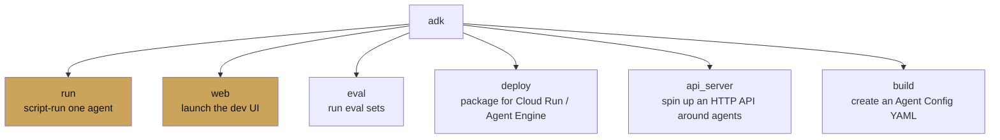

# CLI reference

<span class="kicker">chapter 01 · page 4 of 4</span>

The `adk` command has six subcommands worth knowing on day one. Each
is documented in `adk <subcommand> --help` — this page is the
narrative version.

---

## The six commands



## `adk run`

Run an agent interactively in the terminal.

```bash
adk run agents/support
> Hi, how can I help?
> |
```

Flags worth knowing:

- `--save_session` — write the session to disk when the REPL exits.
- `--replay <path>` — replay a saved session against the agent.
- `--resume <session_file>` — continue a saved session.
- `--model <override>` — override the agent's model for a run.
  Useful for "would this still work on `gemini-2.5-pro`?".

## `adk web`

Launch the dev UI. This is the tool you will use most.

```bash
adk web                       # default host/port
adk web --port 9000
adk web --host 0.0.0.0        # network-accessible (careful)
```

The UI serves from the current directory and discovers every agent
folder under it. Features on top of the chat pane:

- **Event stream** — every event, including state deltas and
  callback returns.
- **Session inspector** — pretty-prints state and history.
- **Trace tab** — OpenTelemetry spans rendered inline.
- **Eval tab** — create `.test.json` files from the current session,
  and run them.
- **Voice/live tab** — opens a bidi stream using the live model if
  the agent's model supports it.

## `adk eval`

Run one or more eval sets.

```bash
adk eval agents/support agents/support/eval/regression.evalset.json
adk eval agents/support agents/support/eval/*.test.json \
  --config_file_path eval/config.json \
  --print_detailed_results
```

`eval/config.json` looks like:

```json
{
  "criteria": {
    "tool_trajectory_avg_score": 0.9,
    "response_match_score": 0.75,
    "rubric_based_final_response_quality_v1": 0.8
  }
}
```

Integrate into CI by failing the job on non-zero exit status.
[Chapter 12](../12-evaluation/index.md) goes deep on this.

## `adk deploy`

Package the current project for a managed target.

```bash
# Vertex AI Agent Engine
adk deploy agent_engine agents/support \
  --project $GOOGLE_CLOUD_PROJECT \
  --region us-central1 \
  --display_name support-bot

# Cloud Run
adk deploy cloud_run agents/support \
  --project $GOOGLE_CLOUD_PROJECT \
  --region us-central1 \
  --service_name support-bot
```

Behind the scenes, `adk deploy cloud_run` builds a Dockerfile and
Cloud Build job; `adk deploy agent_engine` produces a reasoning
engine artifact and uploads it. [Chapter 13](../13-deployment/index.md)
walks through both.

## `adk api_server`

Wrap every agent in the current directory behind an HTTP API, with
sessions managed by your choice of service.

```bash
adk api_server --port 8080 \
  --session_service_url postgres://... \
  --allow_origins https://app.example.com
```

Routes exposed, per agent:

- `POST /agents/{name}/sessions` — create a session.
- `POST /agents/{name}/sessions/{id}/messages` — append a message,
  stream events back.
- `GET  /agents/{name}/sessions/{id}` — fetch state + history.
- `GET  /agents/{name}/eval` — run eval sets defined for the agent.

This is the fastest way to go from "agent works locally" to "agent
is callable by the rest of my org".

## `adk build`

Generate an *Agent Config* — a YAML representation of an agent that
can be edited by people who do not write Python. Experimental in
1.31. Shape:

```yaml
# agent_config.yaml
agent:
  name: support
  model: gemini-2.5-flash
  instruction: |
    You are a concise customer support agent.
  tools:
    - name: lookup_order
      type: function
      module: agents.support.tools
    - name: notion
      type: mcp
      command: npx
      args: ["-y", "@notionhq/notion-mcp-server"]
```

Load with `adk run --config agent_config.yaml`. Useful when
non-engineers need to tune prompts without touching Python.

---

## Shell hygiene

Two small habits that pay back:

```bash
# Put ADK completions in your shell rc
eval "$(adk --completion zsh)"

# Alias the common combos
alias adkw='adk web --port 8000'
alias adkr='adk run'
alias adke='adk eval'
```

---

## What's next

You have finished Chapter 1. Either go deep on the primitives with
[Chapter 2 — Core concepts](../02-core-concepts/index.md), or jump
into agent composition with
[Chapter 3 — Agent types](../03-agent-types/index.md).
