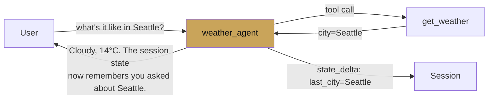
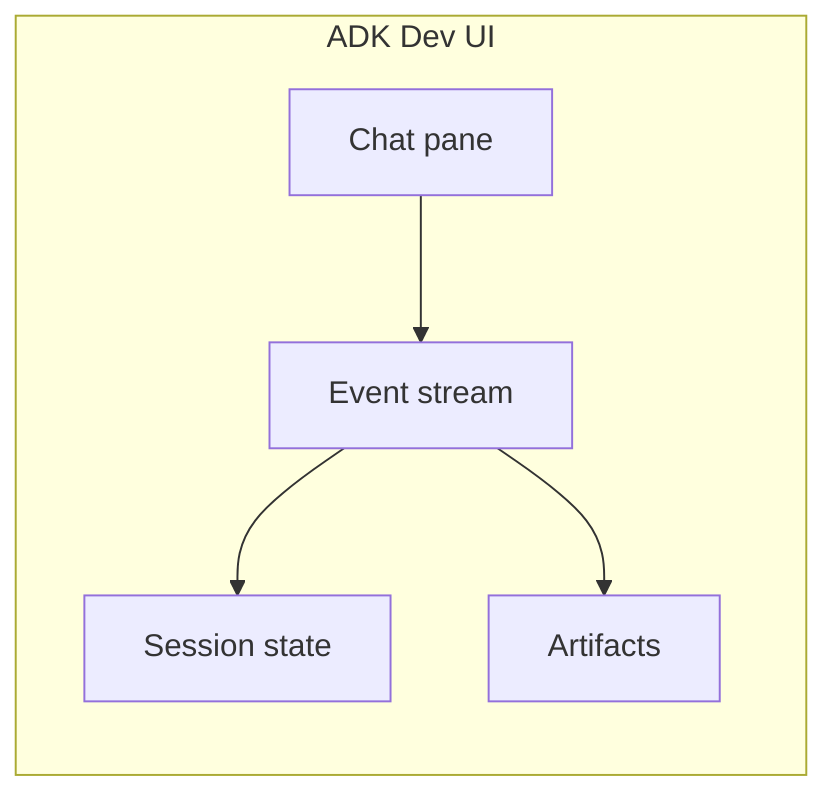

# First agent

<span class="kicker">chapter 01 · page 2 of 4</span>

Build a weather agent three ways: as a script, in the dev UI, and as
a FastAPI server. Same agent, three runners. Fifteen minutes.

---

## The agent



Two tools: one reads from an external API (mocked here), one writes
to session state so the agent can reference a previous city in a
follow-up turn.

Create the layout:

```
weather_agent/
├── __init__.py
├── agent.py
└── main.py
```

### `weather_agent/__init__.py`

```python
from . import agent
```

### `weather_agent/agent.py`

```python
from google.adk.agents import LlmAgent
from google.adk.tools.tool_context import ToolContext


def get_weather(city: str) -> dict:
    """Fetch current weather for a city. Returns dict with tempC, sky."""
    # Replace with a real HTTP call in production.
    fake_db = {
        "Seattle":   {"tempC": 14, "sky": "cloudy"},
        "Bengaluru": {"tempC": 28, "sky": "hazy"},
        "London":    {"tempC": 11, "sky": "drizzle"},
    }
    return fake_db.get(city, {"tempC": None, "sky": "unknown"})


def remember_city(city: str, tool_context: ToolContext) -> str:
    """Persist the city the user is most recently asking about."""
    tool_context.state["last_city"] = city
    return f"Remembered: {city}"


root_agent = LlmAgent(
    name="weather_agent",
    model="gemini-2.5-flash",
    description="A concise weather assistant with a memory for cities.",
    instruction=(
        "You answer weather questions briefly. "
        "When the user mentions a city, call remember_city, then get_weather. "
        "If the user says 'there' or 'it', use state['last_city'] from "
        "session state as the city."),
    tools=[get_weather, remember_city],
)
```

### `weather_agent/main.py`

```python
import asyncio
from google.adk.runners import InMemoryRunner
from google.genai import types
from .agent import root_agent


async def run_once(text: str, runner: InMemoryRunner, session_id: str):
    async for event in runner.run_async(
        user_id="demo",
        session_id=session_id,
        new_message=types.Content(role="user", parts=[types.Part(text=text)])):
        if event.content and event.content.parts:
            for part in event.content.parts:
                if part.text:
                    print(part.text, end="", flush=True)
    print()


async def main():
    runner = InMemoryRunner(agent=root_agent, app_name="weather")
    session = await runner.session_service.create_session(
        app_name="weather", user_id="demo")
    await run_once("What's the weather in Seattle?", runner, session.id)
    await run_once("And how about there right now?", runner, session.id)


if __name__ == "__main__":
    asyncio.run(main())
```

Run it:

```bash
$ python -m weather_agent.main
Seattle is cloudy at 14°C.
You were asking about Seattle — it's cloudy, 14°C.
```

The second turn works because `remember_city` wrote
`state["last_city"]` and the instruction teaches the agent to read
it. This is the smallest example of a primitive you will use
constantly: **state is how the agent has continuity across turns
without relying on the model's token history.**

---

## Same agent, dev UI

```bash
adk web
```

Open `http://127.0.0.1:8000`. The dev UI finds every `agent.py`
that exports `root_agent` under the current directory, shows a chat
pane, and on the right shows the event stream — every token, every
tool call, every state change, every callback.



The dev UI is the single highest-value debugging tool in the
framework. If something is not working, it is faster to open the UI
than to add prints.

---

## Same agent, FastAPI service

```python
# server.py
from contextlib import asynccontextmanager
from fastapi import FastAPI
from google.adk.runners import InMemoryRunner
from google.genai import types
from weather_agent.agent import root_agent

runner: InMemoryRunner | None = None

@asynccontextmanager
async def lifespan(app: FastAPI):
    global runner
    runner = InMemoryRunner(agent=root_agent, app_name="weather")
    yield

app = FastAPI(lifespan=lifespan)

@app.post("/chat")
async def chat(body: dict):
    session = await runner.session_service.get_session(
        app_name="weather", user_id=body["user_id"],
        session_id=body.get("session_id") or "")
    if session is None:
        session = await runner.session_service.create_session(
            app_name="weather", user_id=body["user_id"])
    out = []
    async for e in runner.run_async(
        user_id=body["user_id"],
        session_id=session.id,
        new_message=types.Content(role="user",
                                   parts=[types.Part(text=body["message"])])):
        if e.content and e.content.parts:
            for p in e.content.parts:
                if p.text: out.append(p.text)
    return {"session_id": session.id, "reply": "".join(out)}
```

Run:

```bash
uvicorn server:app --reload
curl -XPOST localhost:8000/chat \
  -H 'content-type: application/json' \
  -d '{"user_id":"u","message":"weather in Bengaluru?"}'
```

That is the shape of the production deployment. Swap `InMemoryRunner`
for `Runner(session_service=VertexAiSessionService(...), ...)` and it
scales horizontally without further changes.

---

## What we just built, in terms of the ten primitives

- **Agent** — `LlmAgent` with a model and two tools.
- **Tool** — `get_weather` (pure function) and `remember_city` (uses
  `ToolContext` to write state).
- **Runner** — `InMemoryRunner` in the script; the dev UI's runner
  in the browser; our own FastAPI-managed runner in the server.
- **Session** — created by `create_session`, identified by
  `session.id`, state written to by `remember_city`.
- **Event** — streamed out of `runner.run_async`, carries text and
  `state_delta`.

Five of the ten primitives, on the first page of code.

---

## What's next

- [Project structure](project-structure.md) — how to scale this
  beyond a single agent file.
- [CLI reference](cli-reference.md) — the `adk` subcommands you will
  use every day.
- [Chapter 2 — Core concepts](../02-core-concepts/index.md) — one
  page per primitive.
