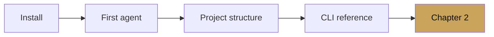

# Chapter 1 — Getting started

chapter 01 · setup and first agent

The quickest path from a clean machine to an agent that works, with
the kind of setup that survives past a demo.

---

## What you will have by the end of this chapter

- A Python virtual environment with `google-adk` 1.31+.
- A `weather_agent/` project that runs locally, via the ADK dev UI,
  and as a standalone script.
- A second tool on that agent that reads and writes session state.
- Familiarity with the four main CLI commands: `adk run`, `adk web`,
  `adk eval`, and `adk deploy`.

---

## The four pages

- [Installation](installation.md) — virtualenv, package, GCP auth,
  environment variables.
- [First agent](first-agent.md) — a single `LlmAgent` with one tool,
  run three different ways.
- [Project structure](project-structure.md) — the layout the rest of
  the cookbook uses.
- [CLI reference](cli-reference.md) — `adk` subcommands, flags, and
  the dev UI.

If you are comfortable with Python packaging and Google Cloud auth,
skip to [First agent](first-agent.md). If not, start with
[Installation](installation.md).
