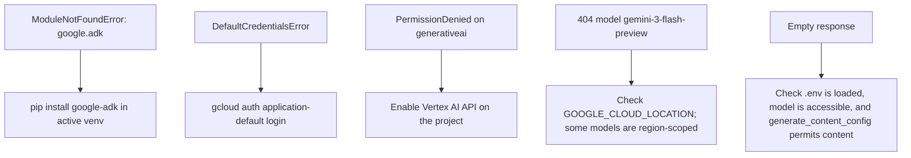

# Installation

<span class="kicker">chapter 01 · page 1 of 4</span>

Ten minutes, end to end. This page assumes Python 3.11+ and `gcloud`
installed.

---

## 1. Create a virtual environment

```bash
mkdir -p ~/projects/adk-cookbook && cd ~/projects/adk-cookbook
python3 -m venv .venv
source .venv/bin/activate        # Linux / macOS
# .venv\Scripts\activate.bat      # Windows
```

One venv per project is the convention in this cookbook. The examples
folder assumes you can activate the venv from the example directory
directly.

## 2. Install the package

```bash
pip install --upgrade pip
pip install "google-adk>=1.31,<2"
```

Optional extras — install only what you need:

```bash
pip install "google-adk[extensions]"       # every optional dep
pip install "google-adk[database]"         # DatabaseSessionService
pip install "google-adk[eval]"             # adk eval + rubric metrics
pip install "google-adk[a2a]"              # A2A client/server extras
pip install "google-adk[mcp]"              # MCPToolset transports
pip install "google-adk[vertex]"           # Vertex session/memory/eval
```

Verify:

```bash
$ adk --version
Agent Development Kit CLI 1.31.1

$ python -c "from google.adk import Agent, Runner; print(Agent, Runner)"
<class 'google.adk.agents.llm_agent.LlmAgent'> <class 'google.adk.runners.Runner'>
```

## 3. Authenticate to Google Cloud

If you intend to use Gemini through Vertex AI (recommended for
production), or any Vertex-backed service (sessions, memory, Agent
Engine), authenticate once:

```bash
gcloud init
gcloud auth application-default login
gcloud config set project YOUR_PROJECT_ID
```

If you are using the Gemini API directly (simpler for local testing):

```bash
export GOOGLE_API_KEY="..."             # from aistudio.google.com
export GOOGLE_GENAI_USE_VERTEXAI=0      # tell ADK to use the API, not Vertex
```

Choose one, not both. Mixing the two is the single most common
source of first-day errors.

## 4. Set environment variables

The cookbook assumes these are in a `.env` at the project root (the
ADK dev UI reads `.env` automatically; the CLI picks it up if you
`source` it first):

```bash
# .env — Vertex path (recommended for teams)
GOOGLE_GENAI_USE_VERTEXAI=true
GOOGLE_CLOUD_PROJECT=my-project-id
GOOGLE_CLOUD_LOCATION=us-central1

# Optional — used by specific chapters
GOOGLE_APPLICATION_CREDENTIALS=./service-account.json   # only for non-ADC paths
ADK_LOG_LEVEL=INFO
```

Or the Gemini API path:

```bash
# .env — Gemini API path (easiest for personal use)
GOOGLE_GENAI_USE_VERTEXAI=false
GOOGLE_API_KEY=ai-...
```

## 5. Smoke test

Create a scratch file:

```python
# scratch.py
import asyncio
from google.adk.agents import LlmAgent
from google.adk.runners import InMemoryRunner
from google.genai import types

root = LlmAgent(
    name="hello",
    model="gemini-3-flash-preview",
    instruction="Reply in one sentence.",
)

async def main():
    runner = InMemoryRunner(agent=root, app_name="hello")
    s = await runner.session_service.create_session(app_name="hello", user_id="u")
    async for e in runner.run_async(
        user_id="u", session_id=s.id,
        new_message=types.Content(role="user",
                                   parts=[types.Part(text="Say hi.")])):
        if e.content and e.content.parts:
            for p in e.content.parts:
                if p.text: print(p.text, end="", flush=True)
    print()

asyncio.run(main())
```

Run it:

```bash
$ python scratch.py
Hello — how can I help?
```

If that prints a single line of output, you are set up correctly. If
it fails on auth, run `gcloud auth application-default login` again
and double-check `GOOGLE_CLOUD_PROJECT`.

---

## Common first-day failures



For the API path, the equivalents:

- `PermissionDenied` → your `GOOGLE_API_KEY` is invalid or the API is
  not enabled.
- Empty response → safety settings are too restrictive; see the
  `generate_content_config` example in `hello_world`.

---

## What's next

- [First agent](first-agent.md) — go from the scratch smoke test to a
  real agent with a tool, state, and structured output.
- [Chapter 13 — Deployment](../13-deployment/index.md) — once you
  want to run this somewhere other than your laptop.
