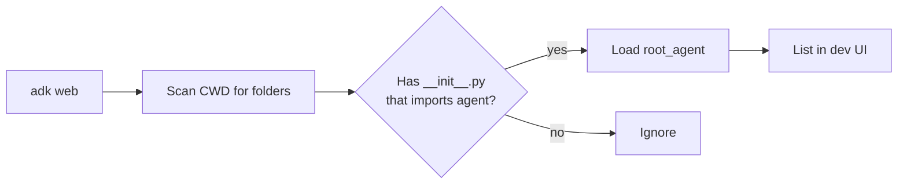

# Project structure

<span class="kicker">chapter 01 · page 3 of 4</span>

The layout the rest of the cookbook uses, and why. This is not the
only layout that works, but it is the one the dev UI, `adk run`, and
the `adk deploy` commands treat as canonical.

---

## The canonical layout

```
my_project/
├── .env                     # GOOGLE_CLOUD_PROJECT etc.
├── .gitignore
├── pyproject.toml           # or requirements.txt
├── README.md
│
├── agents/                  # every agent is a module
│   ├── __init__.py
│   ├── support/
│   │   ├── __init__.py      # imports `from . import agent`
│   │   ├── agent.py         # defines `root_agent`
│   │   ├── tools.py         # function tools used only by this agent
│   │   ├── skills/          # optional SKILL.md directories
│   │   └── eval/            # .test.json and .evalset.json
│   └── research/
│       └── ...
│
├── shared/                  # cross-agent utilities
│   ├── callbacks.py
│   ├── plugins.py
│   └── schemas.py
│
├── services/                # pluggable service implementations
│   ├── session_postgres.py
│   └── memory_vertex.py
│
└── server.py                # optional: FastAPI entry point
```

Three rules make this layout work:

1. **One folder per agent.** `adk web` and `adk run` look for folders
   that contain an `__init__.py` importing `agent`. Flat layouts
   break the dev UI.
2. **`root_agent` is the public export.** Every `agent.py` defines
   exactly one `root_agent`. Sub-agents live in the same file or are
   imported from sibling modules; they do not need to be `root_agent`
   themselves.
3. **Per-agent tests live next to the agent.** Eval sets, test files,
   and skill directories are inside the agent folder. Shared
   callbacks and plugins are the only things in `shared/`.

---

## What the dev UI expects



If a folder has `__init__.py` and that file imports a module called
`agent` which exports `root_agent`, the dev UI shows it. This is why
the two-line `__init__.py` — `from . import agent` — matters.

---

## When to split one agent across files

Threshold: ~250 lines. Under that, keep the whole agent in `agent.py`.
Over that, split:

```
support/
├── agent.py            # root_agent definition, sub-agent wiring
├── tools.py            # function tools
├── callbacks.py        # before_*/after_* hooks
├── prompts.py          # instruction strings, long templates
└── schemas.py          # pydantic models for tools and output_schema
```

`agent.py` imports from the rest. This keeps the agent wiring
legible on one screen.

---

## `pyproject.toml` template

```toml
[project]
name = "my-agents"
version = "0.1.0"
requires-python = ">=3.11"
dependencies = [
  "google-adk>=1.31,<2",
  "google-cloud-aiplatform>=1.60",   # for Vertex path
  "fastapi>=0.110",                  # if you mount a server
  "uvicorn>=0.30",
]

[project.optional-dependencies]
dev = [
  "pytest>=8",
  "pytest-asyncio>=0.23",
  "ruff>=0.6",
  "mypy>=1.10",
]

[tool.adk]
# Picked up by `adk deploy`. Scopes which agents to package.
agents = ["agents.support", "agents.research"]
```

## `.env` template

```bash
# Inference path — pick one
GOOGLE_GENAI_USE_VERTEXAI=true
GOOGLE_CLOUD_PROJECT=your-project
GOOGLE_CLOUD_LOCATION=us-central1

# Observability
ADK_LOG_LEVEL=INFO
OTEL_EXPORTER_OTLP_ENDPOINT=http://localhost:4317
OTEL_SERVICE_NAME=my-agents

# Feature flags — referenced by shared/plugins.py
MY_AGENTS_ENABLE_TRACING=1
MY_AGENTS_APPROVAL_REQUIRED=1
```

---

## Anti-patterns

Three layouts that cause pain later:

- **Flat `agent.py` at the repo root.** Works for a single agent.
  Breaks the moment you add a second one, because the dev UI cannot
  disambiguate.
- **Tests alongside source code without a package.** `test_agent.py`
  in `agents/support/` works if it is inside the package; at the
  repo root it bypasses the per-agent `.env` the dev UI loads.
- **Circular imports between `agent.py` and `shared/callbacks.py`.**
  If a shared callback references the agent, make the callback take
  the agent as an argument rather than importing it.

---

## What's next

- [CLI reference](cli-reference.md) — the `adk` commands that
  operate on this layout.
- [Chapter 13 — Deployment](../13-deployment/index.md) — how the
  same layout packages for Cloud Run and Agent Engine.
