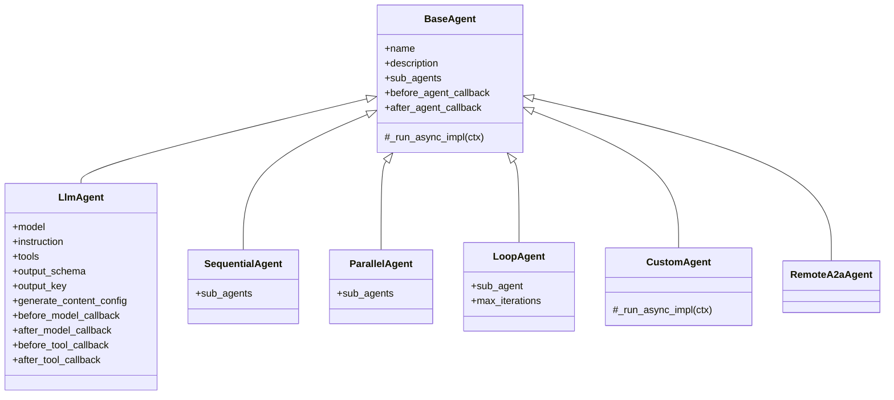
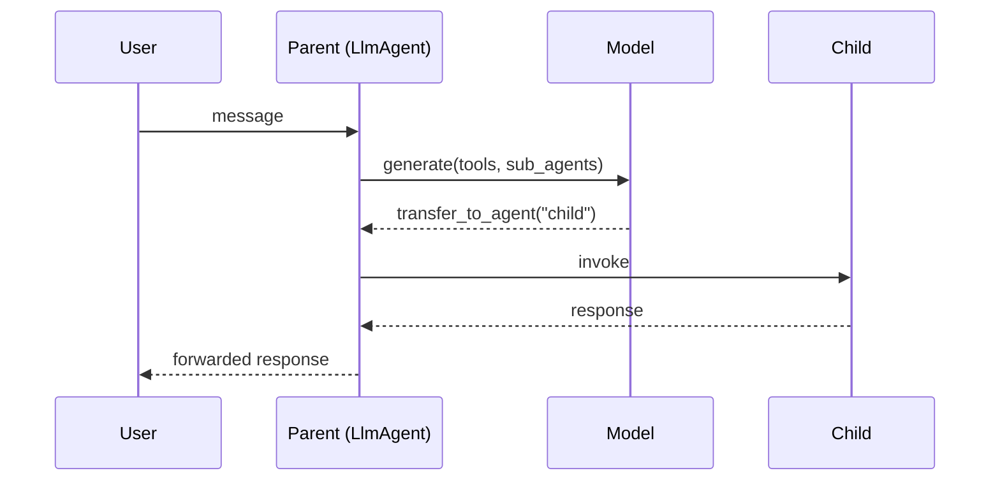

# Agents

<span class="kicker">ch 02 · primitive 1 of 8</span>

The `BaseAgent` abstraction is what lets ADK compose LLM agents with
workflow agents without special-casing either. Everything here flows
from that.

---

## Class hierarchy



Every agent — LLM-backed, workflow, custom, or remote — implements the
same `_run_async_impl(ctx)` that yields events. Composition works
because any agent can be a sub-agent of any other.

## `LlmAgent`

Import: `from google.adk.agents import LlmAgent` (also exported as
`Agent` from the top level).

```python
from google.adk.agents import LlmAgent
from google.genai import types

root = LlmAgent(
    name="planner",
    model="gemini-2.5-pro",
    description="Plans a multi-step task and delegates to workers.",
    instruction="Break the task into 3 steps. Emit steps as JSON.",
    tools=[...],
    sub_agents=[worker_a, worker_b],
    output_schema=PlanSchema,            # pydantic model, validates final output
    output_key="plan",                   # where to stash the output in state
    before_model_callback=...,
    after_model_callback=...,
    before_tool_callback=...,
    after_tool_callback=...,
    before_agent_callback=...,
    after_agent_callback=...,
    generate_content_config=types.GenerateContentConfig(
        temperature=0.2,
        safety_settings=[...],
    ),
)
```

The parameters that matter in 90% of cases: `name`, `model`,
`instruction`, and `tools`. Everything else is an escape hatch.

### `instruction` can be a callable

Instructions take an `instruction_provider` — a function that receives
the `InvocationContext` and returns a string. Use it when the
instruction depends on state:

```python
def instruction_provider(ctx):
    tier = ctx.session.state.get("user:tier", "standard")
    return f"You are a support agent. Tier: {tier}."

root = LlmAgent(
    name="support", model="gemini-2.5-flash",
    instruction=instruction_provider,
    tools=[...],
)
```

### `output_schema` forces structured output

If `output_schema` is set, the agent's final response is parsed into
that pydantic model and written to `state[output_key]`. This is how
you chain a planner into an executor.

```python
class PlanSchema(BaseModel):
    steps: list[str]
    risk: Literal["low", "medium", "high"]

planner = LlmAgent(
    name="planner", model="gemini-2.5-pro",
    instruction="...",
    output_schema=PlanSchema, output_key="plan",
)
executor = LlmAgent(
    name="executor", model="gemini-2.5-flash",
    instruction="Execute the plan in state['plan'].",
)
SequentialAgent(name="pipeline", sub_agents=[planner, executor])
```

## `SequentialAgent`

Runs sub-agents in order. The first sub-agent runs against the user
input; each subsequent one runs with whatever is in state (plus any
new user message the earlier steps did not consume).

```python
from google.adk.agents import SequentialAgent

pipeline = SequentialAgent(
    name="triage_pipeline",
    sub_agents=[classifier, router, responder],
)
```

## `ParallelAgent`

Runs sub-agents concurrently. All sub-agents share the same session
state but emit events independently. When the agent finishes, it has
merged the state deltas.

```python
from google.adk.agents import ParallelAgent

gather = ParallelAgent(
    name="gather_signals",
    sub_agents=[web_search_agent, kb_search_agent, sql_agent],
)
```

Use for fan-out research. Order of completion is not deterministic;
if you need a specific one's result later, use its `output_key` to
address it.

## `LoopAgent`

Runs a single sub-agent repeatedly until either `max_iterations` is
reached or a sub-agent emits `event.actions.escalate = True`.

```python
from google.adk.agents import LoopAgent

refiner = LoopAgent(
    name="refine_until_good",
    sub_agent=critic_and_rewriter,
    max_iterations=4,
)
```

The "stopping condition" is typically written inside the sub-agent:
it reads state, decides whether another pass is warranted, and sets
`event.actions.escalate` when it is satisfied.

## `CustomAgent`

When none of the above fits, subclass `BaseAgent` and implement
`_run_async_impl`. This is rarer than you would think — most branching
is better served by a callback on an `LlmAgent`.

```python
from google.adk.agents import BaseAgent
from google.adk.events import Event

class RoundRobinAgent(BaseAgent):
    def __init__(self, name, sub_agents):
        super().__init__(name=name, sub_agents=sub_agents)
        self._turn = 0

    async def _run_async_impl(self, ctx):
        agent = self.sub_agents[self._turn % len(self.sub_agents)]
        self._turn += 1
        async for event in agent.run_async(ctx):
            yield event
```

## `RemoteA2aAgent`

Consumes a remote agent by its A2A agent-card URL. Used for
federation — see [Chapter 9](../09-multi-agent/a2a-federation.md).

```python
from google.adk.agents.remote_a2a_agent import RemoteA2aAgent

sre = RemoteA2aAgent(name="sre",
    agent_card="https://sre.internal/a2a/agent-card")
root = LlmAgent(name="root", model="gemini-2.5-flash", sub_agents=[sre])
```

---

## Delegation between LLM agents

An `LlmAgent` with `sub_agents=[...]` can *delegate* to one of them
dynamically. The parent's model calls a special "transfer to agent"
action when appropriate:



You enable this by naming sub-agents descriptively and by listing
them as `sub_agents` rather than wrapping them as tools. The parent's
model sees the sub-agent list as candidates.

---

## Rules of thumb

- **Default to `LlmAgent`.** Workflow agents are optimisations.
- **Use `SequentialAgent` when the order is fixed.** Otherwise a
  single `LlmAgent` with sub-agents is more flexible.
- **Use `ParallelAgent` for independent fan-out.** Not for dependent
  work — subsequent state writes will conflict.
- **Use `LoopAgent` for self-critique.** Refinement, retries,
  iterative improvement.
- **Reach for `CustomAgent` last.** If you find yourself writing
  branching logic, it often belongs in a callback instead.

---

## What's next

- [Tools](tools.md) — how agents extend beyond the model.
- [Chapter 3 — Agent types](../03-agent-types/index.md) — worked
  examples of each type.
