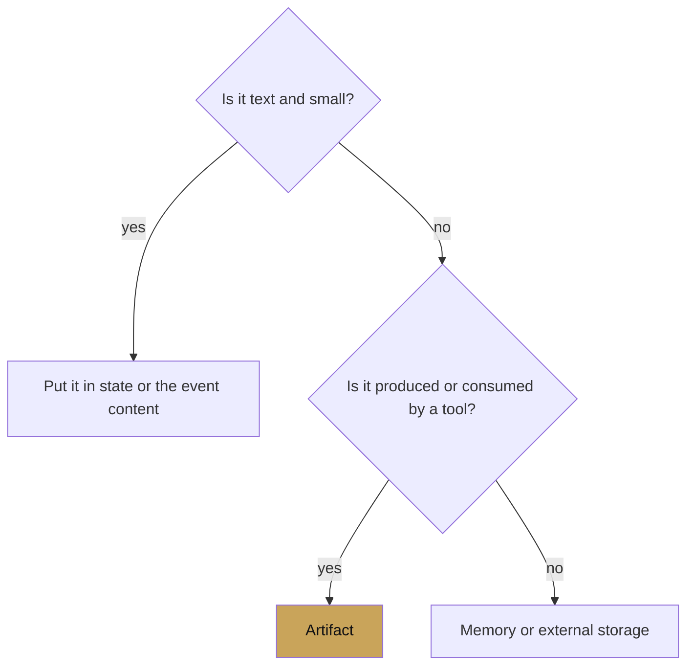
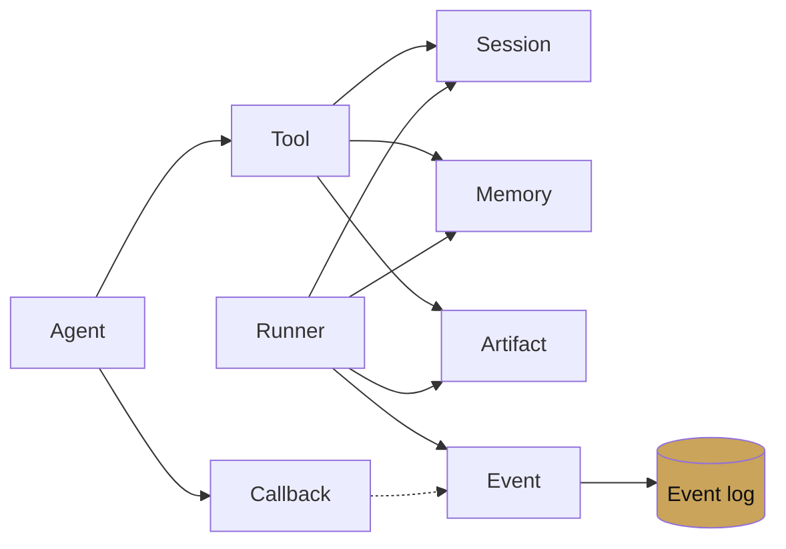

# Artifacts

<span class="kicker">ch 02 · primitive 8 of 8</span>

Artifacts are for things too big for the event log: files, images,
audio clips, PDFs, generated code, binary payloads. They have a
name, a version, a MIME type, and a lifecycle managed by an
`ArtifactService`.

---

## When to use an artifact



Rule of thumb: if the model might need to *read* it in a later turn,
or a tool will *produce* it and another tool will *consume* it,
store it as an artifact. Not in state.

## The three operations

```python
from google.adk.tools.tool_context import ToolContext
from google.genai import types

def extract_pdf(path: str, tool_context: ToolContext) -> dict:
    # Produce
    with open(path, "rb") as f:
        pdf_part = types.Part.from_bytes(data=f.read(), mime_type="application/pdf")
    version = tool_context.save_artifact("input.pdf", pdf_part)

    # Enumerate
    names = tool_context.list_artifacts()

    # Consume
    loaded = tool_context.load_artifact("input.pdf")
    return {"saved_version": version, "known_artifacts": names}
```

`save_artifact` returns the version number. Artifacts are versioned
automatically; `load_artifact(name)` returns the latest by default,
and `load_artifact(name, version=2)` pins a specific one.

## Services

```python
# Dev
from google.adk.artifacts import InMemoryArtifactService

# Vertex — uses GCS under the hood
from google.adk.artifacts import GcsArtifactService
svc = GcsArtifactService(bucket="my-agent-artifacts")

# Your own
from google.adk.artifacts import BaseArtifactService
class MyArtifactService(BaseArtifactService):
    async def save_artifact(self, *, app_name, user_id, session_id,
                             filename, artifact) -> int: ...
    async def load_artifact(self, *, app_name, user_id, session_id,
                             filename, version=None) -> types.Part: ...
    async def list_artifact_keys(self, *, app_name, user_id, session_id): ...
    async def delete_artifact(self, *, app_name, user_id, session_id,
                               filename): ...
    async def list_versions(self, *, app_name, user_id, session_id,
                             filename): ...
```

Wire it onto the runner with `artifact_service=MyArtifactService()`.

## Artifacts in the event log

When a tool saves an artifact, the event's
`actions.artifact_delta` carries `{name: version}`. That is how the
UI knows to show a new file in the session inspector.

```json
{
  "author": "extract_pdf",
  "actions": {"artifact_delta": {"input.pdf": 1}},
  "content": {"parts": [{"function_response": {"name": "extract_pdf", "response": "..."}}]}
}
```

## User-scoped artifacts

Prefix the name with `user:` to persist across sessions for the
same user. The service honours the same prefix semantics as state.

```python
tool_context.save_artifact("user:profile_photo.jpg", part)
```

## Working with large artifacts

- Prefer GCS URIs over raw bytes when the artifact is large. The
  `Part` can contain a `file_data` reference to a GCS URI; the
  model can read it directly if the model supports it (all Gemini
  2.5+ do).
- Do not save an artifact only to hand its bytes right back to
  another tool. Return the name, and let the consumer call
  `load_artifact`. This keeps the event log small.

## Common uses

| Use case | Artifact |
|---|---|
| OCR input | `source.pdf` |
| Model-produced image | `generated.png` |
| Code interpreter output | `sandbox/*.py` |
| Audio recording | `turn-3-user.wav` |
| Chart rendered by a tool | `chart.svg` |

---

## Chapter recap

You have read eight pages, one per primitive. The lattice:



Next: [Chapter 3 — Agent types](../03-agent-types/index.md) puts
these primitives together into five agent patterns.
