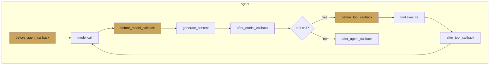

# Callbacks

<span class="kicker">ch 02 · primitive 7 of 8</span>

Callbacks are typed hooks around the three points where an agent
makes a decision: the agent itself, the model call, and the tool
call. Each has a `before_*` and `after_*` variant.

---

## The six hooks



Short-circuit semantics: **returning a truthy value from a `before_*`
callback skips the underlying call and uses your return value
instead.** Returning `None` proceeds normally.

## Signatures

```python
from google.adk.agents.callback_context import CallbackContext
from google.adk.tools.tool_context import ToolContext

def before_agent(cc: CallbackContext) -> types.Content | None: ...
def after_agent(cc: CallbackContext) -> types.Content | None: ...

def before_model(cc: CallbackContext, request) -> types.GenerateContentResponse | None: ...
def after_model(cc: CallbackContext, response) -> types.GenerateContentResponse | None: ...

def before_tool(tool, args: dict, tool_context: ToolContext) -> dict | None: ...
def after_tool(tool, args: dict, tool_context: ToolContext, result: dict) -> dict | None: ...
```

All six can also be `async`.

## Four canonical uses

### 1. Safety / policy

```python
def before_tool(tool, args, ctx):
    if tool.name == "delete_account":
        if not ctx.state.get("user:is_admin"):
            return {"blocked": True, "reason": "admin only"}
```

### 2. Caching

```python
_cache = {}

def before_tool(tool, args, ctx):
    key = (tool.name, tuple(sorted(args.items())))
    if key in _cache:
        return _cache[key]

def after_tool(tool, args, ctx, result):
    key = (tool.name, tuple(sorted(args.items())))
    _cache[key] = result
    return result
```

### 3. Redaction

```python
def after_model(cc, response):
    for part in response.candidates[0].content.parts:
        if part.text:
            part.text = redact_pii(part.text)
    return response
```

### 4. State initialisation

```python
def before_agent(cc):
    cc.state.setdefault("turn_count", 0)
    cc.state["turn_count"] += 1
```

## Plug-in semantics for before/after

Worth being precise about when each fires:

| Hook | Fires |
|---|---|
| `before_agent` | Once per invocation of this agent. |
| `before_model` | Before every `generate_content` call. Includes re-calls after a tool result. |
| `before_tool` | Before every tool execution. |
| `after_tool` | After the tool returns (or raises). |
| `after_model` | After the model returns its response. |
| `after_agent` | Once, when the agent finishes. |

In a tool-calling loop, `before_model` and `after_model` fire
multiple times per invocation — once per round-trip.

## Ordering with sub-agents

If an agent has sub-agents, the sub-agent's callbacks run inside
the parent's. A parent's `before_agent` runs *before* any child's
`before_agent`, and the parent's `after_agent` runs *after* every
child has finished.

## Anti-patterns

- **Mutating `CallbackContext` in an `after_*` callback.** The
  invocation is already committed. Write state in `before_*` or via
  `tool_context` inside a tool.
- **Raising exceptions for business logic.** Use the short-circuit
  return instead; exceptions propagate up and terminate the turn.
- **Long-running I/O in `before_model`.** That call is in the hot
  path of every token generation. Make it fast, or push into a
  background plugin.

---

## What's next

- [Artifacts](artifacts.md) — the last of the eight primitives.
- [Chapter 14 — Safety](../14-safety/index.md) — guardrails and
  approval flows built on callbacks.
