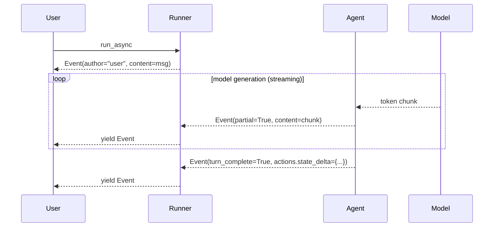
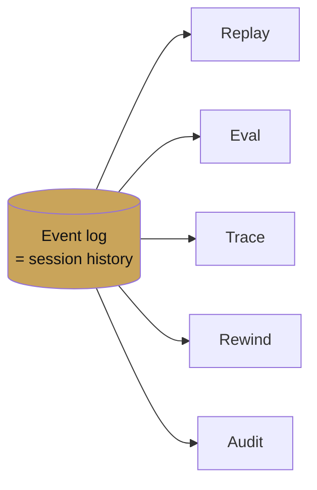

# Events

<span class="kicker">ch 02 · primitive 6 of 8</span>

The event is the unit of everything the runner observes. Tracing is
events. Replay is events. Evaluation is events. Session history is
events. If you internalise one class in ADK, make it `Event`.

---

## Shape

```python
@dataclass
class Event:
    id: str
    invocation_id: str
    author: str                 # agent name or "user"
    timestamp: datetime
    content: types.Content | None
    actions: EventActions
    partial: bool = False       # True for streaming token chunks
    turn_complete: bool = True
    ...

@dataclass
class EventActions:
    state_delta: dict[str, Any] = field(default_factory=dict)
    artifact_delta: dict[str, int] = field(default_factory=dict)
    transfer_to_agent: str | None = None
    escalate: bool = False
    ...
```

## Event flow



A *single turn* produces many events. For a streaming UI, you
render the `partial=True` events as they come in and the final
`turn_complete=True` event finalises the message.

## Reading events

```python
async for event in runner.run_async(...):
    if event.partial:
        # Streaming token chunk — append to current bubble
        for part in event.content.parts:
            if part.text: render_token(part.text)
    elif event.content:
        # Turn-complete; finalise
        if event.actions.state_delta:
            for k, v in event.actions.state_delta.items():
                log_state_change(k, v)
    if event.actions.transfer_to_agent:
        log_delegation(event.author, event.actions.transfer_to_agent)
```

## Important `EventActions` fields

| Field | What it means |
|---|---|
| `state_delta` | Keys the agent or tool wrote. The session service applies these. |
| `artifact_delta` | Artifact name → version created this event. |
| `transfer_to_agent` | The parent should route to this named sub-agent next. |
| `escalate` | The enclosing `LoopAgent` should stop iterating. |

These are the only way workflow semantics propagate. Writing them
from a callback or a `CustomAgent` is how you implement conditional
branching, early termination, and handoff.

## Event log as the source of truth



Everything ADK does with a conversation after the fact is a read
over the event log. That is why the log is structured, typed, and
always on.

## Filtering events in a UI

Typical split for a chat UI:

- **Show:** events whose `content.parts[*].text` is non-empty, and
  whose `author` is an agent (not a tool result).
- **Show as chip:** events with tool calls or `transfer_to_agent`.
- **Hide:** `partial=True` events after the final `turn_complete`.
- **Log:** everything, unfiltered, for debugging and evals.

## What's next

- [Callbacks](callbacks.md) — hooks that fire between events.
- [Chapter 11 — Observability](../11-observability/index.md) —
  exporting the event log to OTel, BigQuery, and dashboards.
