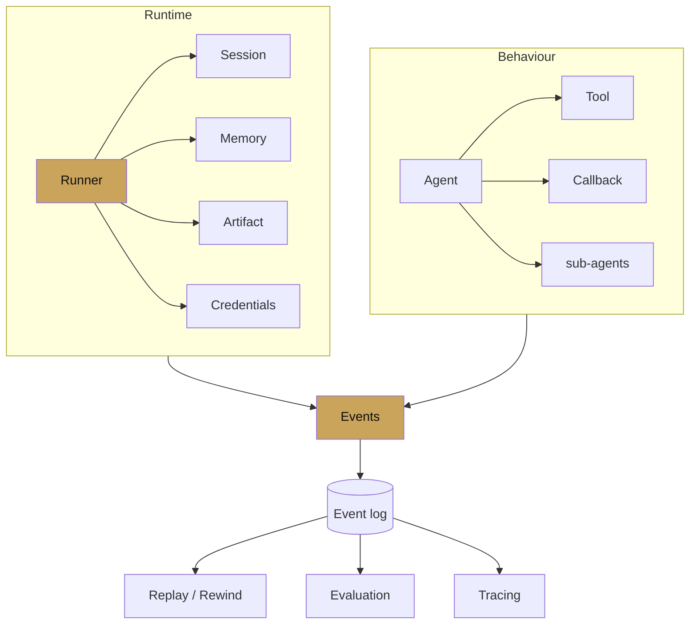

# Chapter 2 — Core concepts

chapter 02 · the primitives, one page each

Eight pages, one primitive per page. Read in order the first time;
bookmark for reference after.

---

## The lattice

Every page in this chapter expands one box of the lattice. The event
log is the shared bus — if you learn only one mental model from this
chapter, make it that one.

## Page index

| Page | Primitive | Why read it |
|---|---|---|
| [Agents](agents.md) | `LlmAgent`, workflow agents, `BaseAgent` | Composition is the whole framework |
| [Tools](tools.md) | function, MCP, OpenAPI, long-running, agent-as-tool | How behaviour extends beyond the model |
| [Sessions](sessions.md) | `Session`, `State`, `SessionService` | Conversation memory and prefix conventions |
| [Memory](memory.md) | `MemoryService`, `load_memory`, Vertex Memory Bank | Cross-session knowledge |
| [Runner](runner.md) | `Runner`, `InMemoryRunner`, service wiring | The drive loop |
| [Events](events.md) | `Event`, `EventActions`, `state_delta` | The structured trace |
| [Callbacks](callbacks.md) | `before_*`/`after_*` hooks | Safety, caching, policy |
| [Artifacts](artifacts.md) | `ArtifactService`, binary payloads | Files, images, large tool outputs |

After this chapter, [Chapter 3 — Agent types](../03-agent-types/index.md)
puts the composition primitives to work.
