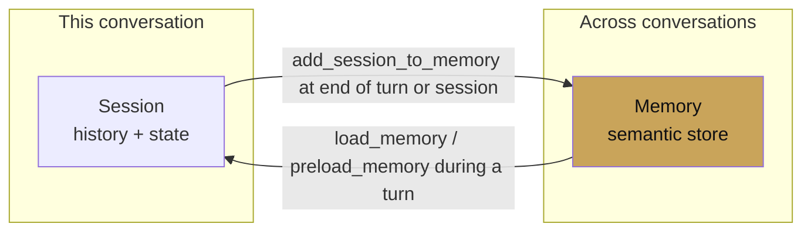

# Memory

<span class="kicker">ch 02 · primitive 4 of 8</span>

Memory is the store of knowledge that outlives a single session. A
`Session` gives you "what has the user said *in this conversation*";
a `MemoryService` gives you "what do we know about this user across
conversations."

---

## Session vs memory



Rules of thumb:

- Use **session state** for anything this conversation touches.
  Cheap, synchronous, deterministic.
- Use **memory** for facts you want to surface in *future*
  conversations. Preferences, history, relationships.
- Never use memory as a scratchpad for in-flight work. That is what
  state is for.

## Services

```python
# Dev
from google.adk.memory import InMemoryMemoryService
dev_memory = InMemoryMemoryService()

# Prod, managed
from google.adk.memory import VertexAiMemoryBankService
prod_memory = VertexAiMemoryBankService(
    project="proj",
    location="us-central1",
    agent_engine_id="1234567890",
)

# RAG-backed memory
from google.adk.memory import VertexAiRagMemoryService
rag_memory = VertexAiRagMemoryService(rag_corpus=os.environ["RAG_CORPUS"])
```

`InMemoryMemoryService` is keyword search; fine for tests.
`VertexAiMemoryBankService` is semantic, managed, and — notably —
runs an LLM to *extract* memories from sessions, so it is selective
about what it saves rather than dumping every turn.

## Two ways to read memory

```python
from google.adk.tools.load_memory_tool import load_memory_tool
from google.adk.tools.preload_memory_tool import preload_memory_tool

# On-demand — the model decides when to search.
agent = LlmAgent(model="gemini-3.1-flash", tools=[load_memory_tool])

# Eager — the runtime searches at the start of every turn and
# injects the results into the prompt.
agent = LlmAgent(model="gemini-3.1-flash", tools=[preload_memory_tool])
```

Pick eager if the agent is heavily memory-dependent (e.g. a
long-term personal assistant). Pick on-demand if memory is only
sometimes relevant — you save tokens.

## Ingestion: `add_session_to_memory`

At the end of a session (or at any intentional "summarise this now"
point), push the session's content into memory:

```python
async def auto_save_callback(cc):
    await cc._invocation_context.memory_service.add_session_to_memory(
        cc._invocation_context.session)

root = LlmAgent(
    model="gemini-3.1-flash",
    tools=[preload_memory_tool],
    after_agent_callback=auto_save_callback,
)
```

The `VertexAiMemoryBankService` does not store verbatim — it runs a
small LLM that extracts structured memories (preferences, facts,
entities) and reconciles them with existing ones. That is why it is
the right default for a long-running personal assistant.

## Reading memory inside a tool

```python
from google.adk.tools.tool_context import ToolContext

def summarise_user(tool_context: ToolContext) -> str:
    hits = tool_context.search_memory(
        "user preferences and history with this product")
    return "\n".join(m.text for m in hits.memories[:10])
```

`search_memory` returns a ranked list. You decide how many to keep
and how to format them for the model.

## Anti-patterns

- **Writing every turn to memory.** Produces noise and cost. Let the
  extraction LLM do the work (Vertex Memory Bank) or write
  selectively.
- **Using memory for current-turn scratchpad.** Use `state["temp:..."]`.
- **Putting secrets into memory.** Credentials belong in the
  `CredentialService`, not in memory.

---

## What's next

- [Runner](runner.md) — where memory is wired into the runtime.
- [Chapter 10 — Memory patterns](../10-memory-patterns/index.md) —
  full recipes including summarisation and compaction.
