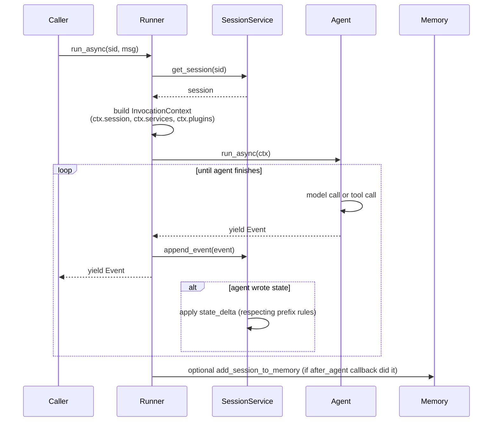

# Runner

<span class="kicker">ch 02 · primitive 5 of 8</span>

The runner is the loop that drives an agent from a user message to a
stream of events. You rarely extend it — you pick one, give it the
right services, and call `run_async` or `run_live`.

---

## The two built-in runners

```python
from google.adk.runners import Runner, InMemoryRunner
```

- **`InMemoryRunner`** — every service is in-process. Great for
  tests and demos. Its `session_service` is a real
  `InMemorySessionService` you can poke at.
- **`Runner`** — the real thing. You pass explicit services.

## Constructor signature

```python
class Runner:
    def __init__(self, *,
                 app=None, app_name=None, agent=None,
                 plugins=None,
                 artifact_service=None,
                 session_service: BaseSessionService,
                 memory_service=None,
                 credential_service=None,
                 plugin_close_timeout=5.0,
                 auto_create_session=False): ...
```

The only non-obvious parameters:

- **`plugins`** — attach `RunnerPlugin`s (tracing, retries, per-tenant
  policy). [Chapter 11](../11-observability/index.md) goes into this.
- **`credential_service`** — if your tools request credentials
  (OAuth, API keys), they go through this service.
- **`plugin_close_timeout`** — how long to wait for plugins to flush
  on shutdown.

## The two ways to run

```python
# Text / tool-calling — the default path.
async for event in runner.run_async(
    user_id="u",
    session_id=sid,
    new_message=types.Content(role="user", parts=[types.Part(text="...")])):
    ...

# Bidirectional live — voice/video/streaming audio.
queue = LiveRequestQueue()
async for event in runner.run_live(
    user_id="u",
    session_id=sid,
    live_request_queue=queue,
    run_config=RunConfig(
        response_modalities=["AUDIO"],
        speech_config=SpeechConfig(
            voice_config=VoiceConfig(prebuilt_voice_config=PrebuiltVoiceConfig(
                voice_name="Aoede"))))):
    ...
```

Same agent. Same session. Different entry point.

## What happens inside



Three things worth noticing:

1. **State deltas flow through the service**, not around it. That is
   why rewind and replay work.
2. **Events are yielded as they happen**. The runner is a generator.
   For a streaming UI, that is exactly what you want.
3. **Plugins see everything the agent sees.** A tracing plugin does
   not need to touch the agent code.

## Plugins

Runner-scoped extensions. Signature:

```python
from google.adk.plugins.base_plugin import BasePlugin

class TracingPlugin(BasePlugin):
    async def on_before_run(self, ctx): ...
    async def on_event(self, ctx, event): ...
    async def on_after_run(self, ctx): ...
```

Attach:

```python
runner = Runner(
    agent=root,
    session_service=svc,
    plugins=[TracingPlugin(), ToolRetryPlugin(max_attempts=3)],
)
```

Use plugins for cross-cutting concerns that should apply to every
agent. Use callbacks for agent-specific behaviour.

## `RunConfig`

Controls modality and streaming behaviour at runtime.

```python
from google.adk.agents.run_config import RunConfig, StreamingMode

cfg = RunConfig(
    streaming_mode=StreamingMode.SSE,
    response_modalities=["TEXT"],
    max_llm_calls=10,             # safety cap
    output_audio_transcription=True,
    input_audio_transcription=True,
)

async for e in runner.run_async(..., run_config=cfg):
    ...
```

---

## Anti-patterns

- **Recreating the runner per request.** It is cheap to keep around.
  Instantiate once at application startup.
- **Sharing a session across users.** Unless that is the intent
  (shared channels), set `user_id` to the real user and let the
  service key by `(app_name, user_id, session_id)`.
- **Swallowing events.** Even if you do not want to show them in the
  UI, consume them — otherwise the runner back-pressures and your
  tool calls stall.

---

## What's next

- [Events](events.md) — what the runner actually yields.
- [Chapter 11 — Observability](../11-observability/index.md) —
  instrumenting the runner for production.
