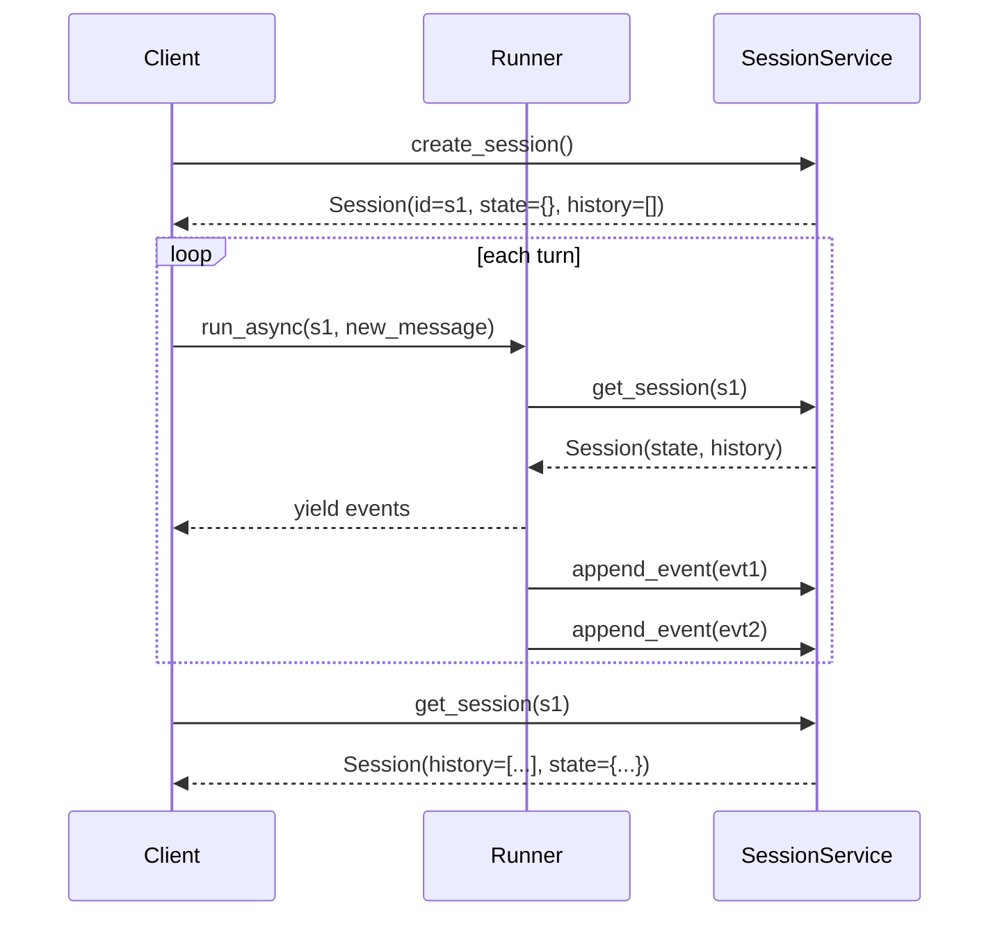

# Sessions

<span class="kicker">ch 02 · primitive 3 of 8</span>

A session is a single conversation. It has a `history` (the events
that have happened), a `state` (a dictionary the agent and tools
read and write), and an `id`.

---

## The three session services

```mermaid
flowchart LR
  subgraph Dev[Development]
    A[InMemorySessionService]
  end
  subgraph Self[Self-hosted]
    B[DatabaseSessionService<br/>Postgres / MySQL / SQLite]
  end
  subgraph Managed[Managed]
    C[VertexAiSessionService<br/>Agent Engine backed]
  end
  A -->|pip install google-adk| A1[In process; lost on restart]
  B -->|pip install 'google-adk[database]'| B1[Survives restart; multi-instance]
  C -->|pip install 'google-adk[vertex]'| C1[HA + replay + rewind + auditing]
  style C fill:#c9a45a,color:#0f0f12
```

All three satisfy `BaseSessionService`:

```python
class BaseSessionService:
    async def create_session(self, *, app_name, user_id, state=None,
                             session_id=None): ...
    async def get_session(self, *, app_name, user_id, session_id,
                          config=None): ...
    async def list_sessions(self, *, app_name, user_id): ...
    async def append_event(self, session, event): ...
    async def delete_session(self, *, app_name, user_id, session_id): ...
```

Swap the service and everything above the runner is unchanged.

## Picking a service

```python
# Dev
from google.adk.sessions import InMemorySessionService
svc = InMemorySessionService()

# Self-hosted Postgres
from google.adk.sessions import DatabaseSessionService
svc = DatabaseSessionService(db_url="postgresql+asyncpg://user:pw@host/db")

# Vertex AI Agent Engine
from google.adk.sessions import VertexAiSessionService
svc = VertexAiSessionService(project="proj", location="us-central1",
                             agent_engine_id="1234567890")
```

Wire it up:

```python
from google.adk.runners import Runner
runner = Runner(agent=root_agent,
                session_service=svc,
                memory_service=...,
                artifact_service=...)
```

## `Session` and `State`

```python
session = await runner.session_service.get_session(
    app_name="support", user_id="u42", session_id=sid)

# Read state
tier = session.state.get("user:tier", "standard")

# State is a dict-like with prefix semantics
session.state["last_city"] = "Seattle"       # session-scoped
session.state["user:name"] = "Vikas"         # user-scoped, cross-session
session.state["app:motd"] = "holiday hours"  # app-scoped, every session
session.state["temp:token"] = "..."          # invocation-scoped only
```

| Prefix | Scope |
|---|---|
| `user:` | Persists across all sessions for the same `(app_name, user_id)`. |
| `app:`  | Persists across every session in the app. |
| `temp:` | Wiped at the end of the invocation. Never persists. |
| *(none)* | Persists inside this session only. |

The service is responsible for honouring those semantics. Every
built-in service does.

## Writing state — do not mutate `session.state` directly from a tool

In tool code, use `tool_context.state` instead. The runner collects
the writes into `event.actions.state_delta` and persists them through
the service. If you reach into the raw `Session` object, you bypass
the event log and lose replay fidelity.

```python
# Good
def remember_city(city: str, tool_context: ToolContext) -> str:
    tool_context.state["last_city"] = city
    return f"Remembered {city}"

# Bad — bypasses the event log
def remember_city_wrong(city: str, tool_context: ToolContext) -> str:
    tool_context._invocation_context.session.state["last_city"] = city  # don't
    return f"Remembered {city}"
```

## Session lifecycle



## Rewinding a session

Session rewind is the *"re-run from turn N with a different model or
tool"* primitive. The `rewind_session` sample in `adk-python` is the
reference.

```python
# Truncate history at event N and re-run with a different agent.
session = await runner.session_service.get_session(...)
truncated = session.model_copy(update={"history": session.history[:10]})
await runner.session_service.update_session(truncated)
# Subsequent runs pick up from truncated history.
```

This is one of the primitives that makes ADK feel like a platform
rather than a chain library. You do not lose a conversation to a bad
generation — you rewind and try differently.

## Multi-session patterns

- **One session per user, per conversation.** The default.
- **Shared session for a team channel.** Set `user_id="channel-42"`
  and `app_name="slack-support"`. Every user's message appends to
  the same session.
- **Short-lived sessions for stateless tasks.** `create_session`,
  run, let the session be garbage-collected. Useful for batch jobs.

---

## What's next

- [Memory](memory.md) — cross-session knowledge.
- [Chapter 10 — Memory patterns](../10-memory-patterns/index.md) —
  practical recipes including session state vs memory.
