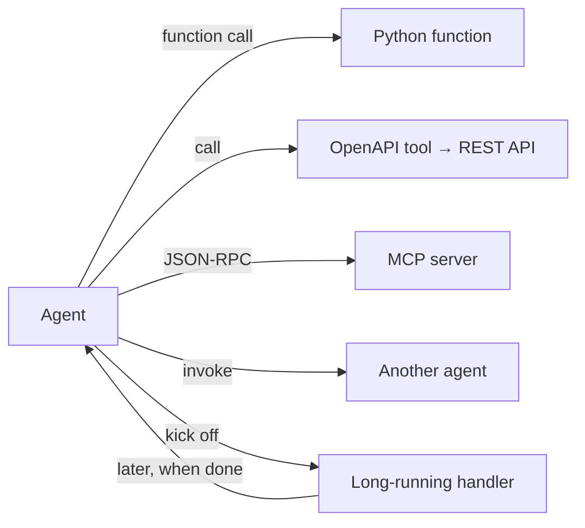
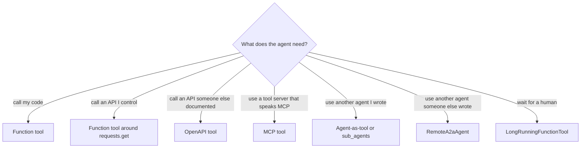

# Tools

<span class="kicker">ch 02 · primitive 2 of 8</span>

Tools are how an agent reaches beyond the model. ADK treats five
categories of thing as a tool: a Python function, an OpenAPI-described
API, an MCP server, another agent, and a long-running handler.

---

## Mental model



All five satisfy a single contract: they receive a validated input,
they return a JSON-serialisable output, and — if they care about
state — they accept a `ToolContext`.

## Function tools

Simplest and most common. Docstrings and type hints become the
schema the model sees.

```python
def get_weather(city: str) -> dict:
    """Return the current weather for `city`.

    Args:
      city: City name in English, e.g. "Seattle".

    Returns:
      A dict with tempC (int) and sky (str).
    """
    ...
```

Pass them as `tools=[get_weather, ...]` to an `LlmAgent`.

Rules:

- **Type hints are mandatory.** The model sees them as the JSON
  schema.
- **Docstrings are the model's prompt.** The first line is the
  short description. Write them for a colleague, not a search bot.
- **Return JSON-serialisable values.** dicts, lists, primitives,
  pydantic models. Not datetime, not custom classes.
- **Side effects go through `ToolContext`.** See below.

### `ToolContext`

A function can accept a special `tool_context: ToolContext` parameter
as its last argument. ADK recognises it and injects the context —
the model does not see it as a parameter.

```python
from google.adk.tools.tool_context import ToolContext

def remember_city(city: str, tool_context: ToolContext) -> str:
    tool_context.state["last_city"] = city           # write session state
    mems = tool_context.search_memory("cities user mentioned")  # long-term
    tool_context.save_artifact("city.txt", part)     # file storage
    return f"Remembered {city}"
```

State, memory, artifacts, and credentials all live on the
`ToolContext`. [Chapter 10](../10-memory-patterns/index.md) goes
into which to reach for when.

## OpenAPI tools

Point at a spec, get a tool per operation.

```python
from google.adk.tools.openapi_tool.openapi_spec_parser import OpenApiTool

billing = OpenApiTool(
    spec_path="./billing.yaml",
    auth_scheme="api_key",      # or "oauth2", "bearer", "none"
    api_key_env="BILLING_KEY",
)
root_agent = LlmAgent(name="root", model="gemini-3.1-flash",
                     tools=[billing])
```

Each operation becomes a tool the agent can call. The spec's
`operationId` becomes the tool name.

## MCP tools

Model Context Protocol is the open standard for tool servers.
ADK's `MCPToolset` consumes any MCP server over stdio, SSE, or
streamable HTTP.

```python
from google.adk.tools.mcp_tool.mcp_toolset import (
    MCPToolset, StdioServerParameters)

notion = MCPToolset(connection_params=StdioServerParameters(
    command="npx",
    args=["-y", "@notionhq/notion-mcp-server"],
    env={"OPENAPI_MCP_HEADERS": notion_headers}))

root_agent = LlmAgent(name="notion_agent", model="gemini-3.1-flash",
                     tools=[notion])
```

Real-world MCP servers: Notion, Slack, Google Drive, Postgres,
BigQuery, GitHub, Linear, Stripe. [Chapter 4 — MCP tools](../04-tools/mcp-tools.md)
covers transports, auth, and dynamic headers.

## Agent-as-tool

Wrap another agent and expose it as a tool. Useful when you want
hierarchical control without the LLM-delegation semantics of
`sub_agents`.

```python
from google.adk.tools.agent_tool import AgentTool

translator_tool = AgentTool(agent=translator_agent)
root = LlmAgent(name="root", model="gemini-3.1-flash",
               tools=[translator_tool])
```

The wrapped agent runs with its own session, its own tools, and
returns its final output as the tool result.

## Long-running tools

A long-running tool starts work, returns a handle, and completes
later. The agent can do other things while the tool is in flight —
this is ADK's primary human-in-the-loop mechanism.

```python
from google.adk.tools.long_running_tool import LongRunningFunctionTool

def ask_for_approval(amount: float, reason: str) -> dict:
    """Request human approval for a reimbursement."""
    # Emit a notification, return a handle.
    # The actual approval arrives via a resumed invocation.
    ...

root = LlmAgent(
    name="reimbursements", model="gemini-3.1-flash",
    tools=[reimburse, LongRunningFunctionTool(func=ask_for_approval)],
)
```

The agent pauses until someone resumes the session with the
approval payload. See the `human_in_loop` sample for the full flow.

---

## When to reach for which



A rough preference order:

1. Function tool (simplest, debuggable).
2. MCP tool (if a good server exists).
3. OpenAPI tool (if the API has a reasonable spec).
4. Agent-as-tool or sub-agents (if the behaviour is itself an agent).
5. Long-running tool (only when a human is involved).

## Tool-calling configuration

On `LlmAgent`, two kwargs control tool selection:

- `tool_choice="auto"` (default) — model decides.
- `tool_choice="required"` — model must call a tool.
- `tool_choice="none"` — model cannot call tools.
- `tool_choice={"name": "get_weather"}` — force one specific tool.

Use `tool_choice="required"` for the first turn of a pipeline step
where calling *something* is mandatory.

---

## What's next

- [Sessions](sessions.md) — where state lives.
- [Callbacks](callbacks.md) — before/after hooks around tool calls.
- [Chapter 4 — Tools](../04-tools/index.md) — worked examples for
  each kind.
