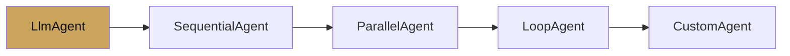

# Chapter 3 — Agent types

chapter 03 · worked examples

Chapter 2 introduced the five agent types as classes. This chapter
builds a full example for each, end-to-end, runnable.

| Page | Builds |
|---|---|
| [LLM agent](llm-agent.md) | A single `LlmAgent` with structured output. |
| [Sequential agent](sequential-agent.md) | Planner → researcher → writer. |
| [Parallel agent](parallel-agent.md) | Three search backends in parallel, merged. |
| [Loop agent](loop-agent.md) | A critic that refines a draft until satisfied. |
| [Custom agent](custom-agent.md) | A round-robin agent from `BaseAgent`. |

Every example in this chapter corresponds to a runnable folder in
[`examples/`](https://github.com/vmishra/Google-ADK-Cookbook/tree/main/examples).
