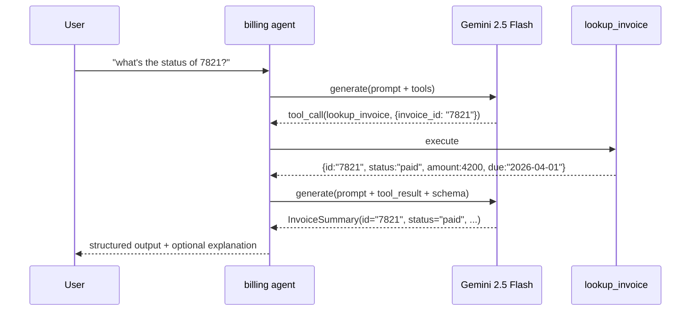

# LLM agent

<span class="kicker">ch 03 · page 1 of 5</span>

The workhorse. A single `LlmAgent` with a model, an instruction, and
some tools. 80% of ADK projects start — and many end — here.

---

## The build

```python
# agents/billing/agent.py
from pydantic import BaseModel
from google.adk.agents import LlmAgent
from google.adk.tools.tool_context import ToolContext


class InvoiceSummary(BaseModel):
    invoice_id: str
    status: str
    amount_cents: int
    due_date: str


def lookup_invoice(invoice_id: str) -> dict:
    """Return the invoice record for `invoice_id`, or raise if not found."""
    ...


def mark_paid(invoice_id: str, tool_context: ToolContext) -> dict:
    """Mark an invoice as paid. Requires user:is_admin in state."""
    if not tool_context.state.get("user:is_admin"):
        return {"ok": False, "reason": "admin-only operation"}
    ...
    tool_context.state["last_marked_paid"] = invoice_id
    return {"ok": True}


root_agent = LlmAgent(
    name="billing",
    model="gemini-3.1-flash",
    description="Looks up invoices and explains their status briefly.",
    instruction=(
        "You help users understand their invoices. "
        "Use lookup_invoice to fetch the record, then summarise."),
    tools=[lookup_invoice, mark_paid],
    output_schema=InvoiceSummary,
    output_key="invoice_summary",
)
```

## How it runs



Because `output_schema=InvoiceSummary`, ADK validates the final
response against the schema and also writes it into
`state["invoice_summary"]` — ready for a downstream agent.

## What the instruction should say

Three paragraphs is too long. Four lines is about right.

```
You help users understand their invoices.
For every question, call lookup_invoice with the id the user gives.
If the user tries to mark paid without admin, politely refuse.
Return a short summary and the structured InvoiceSummary.
```

Resist the temptation to put tool call examples in the instruction.
Examples belong in one-shot / few-shot form if needed, not in prose
("also remember to call lookup_invoice…"). The model learns tool use
from the schemas, not from the prompt.

## Gotchas

- **`output_schema` narrows the agent's versatility.** Once set, the
  agent's output is always a validated object — you lose free-form
  text in the same turn. Split into two agents (responder + formatter)
  if you need both.
- **Tool docstrings are first-class prompts.** Rewrite them when the
  model picks the wrong tool. 80% of "wrong tool" bugs are prompt
  bugs in the docstring.
- **Do not put `tool_context` in the docstring.** It is not a real
  parameter from the model's perspective.

---

## Running this example

```bash
cd examples/01-hello-agent   # or the 02-tool-calling folder
pip install -r requirements.txt
python -m agent
```

See [`examples/01-hello-agent`](https://github.com/vmishra/Google-ADK-Cookbook/tree/main/examples/01-hello-agent).
