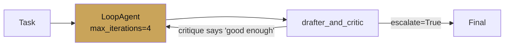
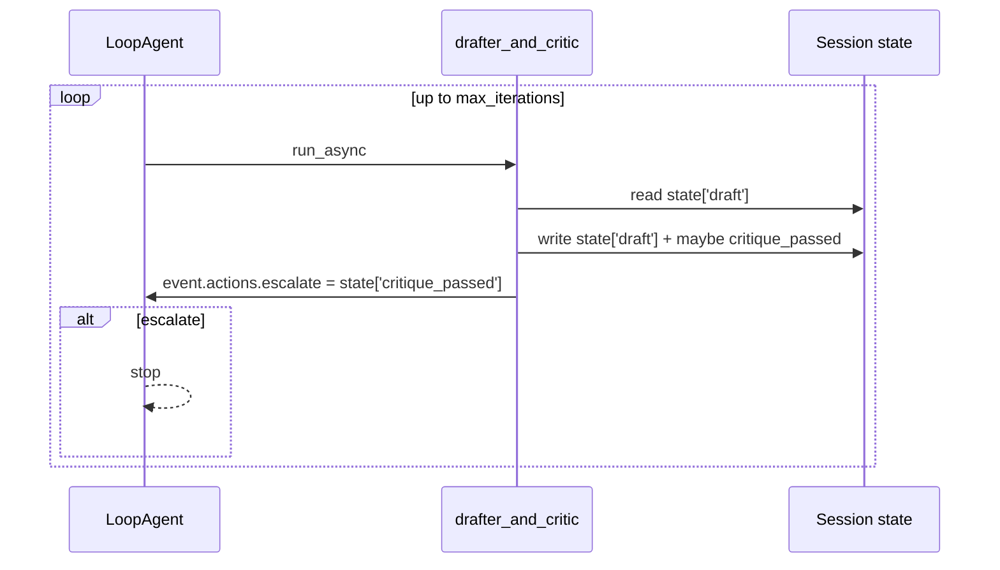

# Loop agent

<span class="kicker">ch 03 · page 4 of 5</span>

Runs one sub-agent over and over until either `max_iterations` is hit
or the sub-agent emits `event.actions.escalate = True`. The ADK way
to implement "keep going until it is good enough."

---

## The build: drafter → critic → drafter

A single sub-agent that alternates between drafting and critiquing,
stopping when the critique is clean.



```python
from google.adk.agents import LlmAgent, LoopAgent
from google.adk.agents.callback_context import CallbackContext


def stop_if_approved(cc: CallbackContext):
    if cc.state.get("critique_passed"):
        cc.event_actions.escalate = True


drafter_and_critic = LlmAgent(
    name="drafter_and_critic",
    model="gemini-3.1-pro",
    instruction=(
        "You maintain state['draft'] and state['critique_passed'] (bool). "
        "Step 1: if state['draft'] is empty, write an initial draft. "
        "Step 2: critique the current draft for clarity, factuality, tone. "
        "Step 3: if the critique has any non-trivial issue, rewrite. "
        "Step 4: if the draft is clean, set state['critique_passed']=True."),
    after_agent_callback=stop_if_approved,
    output_key="draft",
)

root_agent = LoopAgent(
    name="refine_until_good",
    sub_agent=drafter_and_critic,
    max_iterations=4,
)
```

## State over iterations

Each iteration of the loop sees the session state from the previous
iteration. The stopping condition is a boolean in state, set by the
sub-agent, read by the callback, translated to `escalate`.



## Guard rails

- **Always set `max_iterations`.** Even with a good stopping
  condition, bound the loop. 3–5 is typical; 10 is an upper bound
  for most tasks.
- **Use a small, fast model for the critic if you split.** Splitting
  drafter and critic is often clearer than combining them:
  ```python
  drafter = LlmAgent(name="drafter", model="gemini-3.1-pro", ...)
  critic  = LlmAgent(name="critic",  model="gemini-3.1-flash", ...)
  pair    = SequentialAgent(sub_agents=[drafter, critic])
  root    = LoopAgent(sub_agent=pair, max_iterations=4)
  ```
- **Make the stopping signal explicit.** A boolean in state beats
  pattern-matching the model's prose.

## When to prefer LoopAgent over a retry decorator

- When the *target* changes each iteration (a draft is different
  from the previous draft).
- When the critic is itself a model call you want in the event log.
- When you need evaluation to see each iteration.

If the thing you want to retry is a flaky API call, use a plugin or
a tool-level retry instead.

---

## See also

- [`examples/05-loop-agent-refiner`](https://github.com/vmishra/Google-ADK-Cookbook/tree/main/examples/05-loop-agent-refiner)
- [Chapter 15 — Cost & latency](../15-cost-latency/index.md) — when a
  loop is cheaper than a bigger single call.
