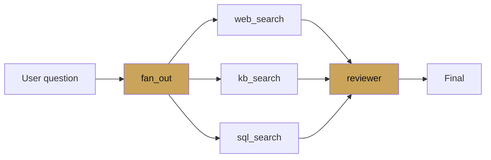

# Parallel agent

<span class="kicker">ch 03 · page 3 of 5</span>

Runs sub-agents concurrently. Best for independent fan-out — multiple
search backends, multiple database shards, multiple competing
drafters.

---

## The build: three search backends



```python
from google.adk.agents import LlmAgent, ParallelAgent, SequentialAgent
from google.adk.tools import google_search

web = LlmAgent(
    name="web_search",
    model="gemini-3-flash-preview",
    instruction="Search the web for recent coverage. Write 3-5 bullets to state['web_notes'].",
    tools=[google_search],
    output_key="web_notes",
)

kb = LlmAgent(
    name="kb_search",
    model="gemini-3-flash-preview",
    instruction="Search the internal KB for canonical answers. Write to state['kb_notes'].",
    tools=[kb_lookup],
    output_key="kb_notes",
)

sql = LlmAgent(
    name="sql_search",
    model="gemini-3-flash-preview",
    instruction="Query the events DB for incidents in the last 30 days. Write state['sql_notes'].",
    tools=[run_sql],
    output_key="sql_notes",
)

fan_out = ParallelAgent(name="fan_out", sub_agents=[web, kb, sql])

reviewer = LlmAgent(
    name="reviewer",
    model="gemini-3.1-pro-preview",
    instruction=(
        "You have state['web_notes'], state['kb_notes'], state['sql_notes']. "
        "Reconcile them and write a single answer. Cite every fact."),
)

root_agent = SequentialAgent(
    name="research_then_review",
    sub_agents=[fan_out, reviewer],
)
```

## State isolation

All three parallel agents share the same session state, but because
each writes to a different `output_key`, they do not collide.

**Never have two parallel agents write to the same key.** The last
writer wins, and which is last is not deterministic. If two agents
legitimately produce the same kind of data, give each its own key and
merge in the reviewer.

## Failure handling

If one sub-agent fails, the parallel agent still waits for the others
and emits a partial state. The reviewer needs to handle missing keys:

```python
reviewer = LlmAgent(
    name="reviewer",
    model="gemini-3.1-pro-preview",
    instruction=(
        "You may or may not have state['web_notes'], state['kb_notes'], "
        "state['sql_notes']. Reconcile whichever are present. "
        "If none are present, ask for a different question."),
)
```

## When to reach for parallel

- Multiple retrieval backends that each return candidates.
- Multiple agents rating the same input on different axes (e.g. a
  factual-accuracy rater and a tone rater).
- Speculative drafts from different models (Gemini Pro and Flash,
  then a reviewer picks).

## When *not* to

- Side-effectful tools that would step on each other. Parallel is for
  reads and generation; keep writes sequential.
- Rate-limited APIs. The parallel agent *will* issue concurrent
  requests.

---

## See also

- [`examples/04-parallel-research`](https://github.com/vmishra/Google-ADK-Cookbook/tree/main/examples/04-parallel-research)
- [Chapter 8 — Deep research](../08-deep-research/index.md)
