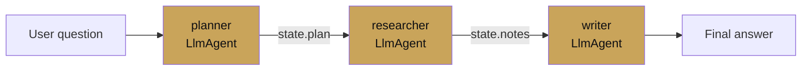
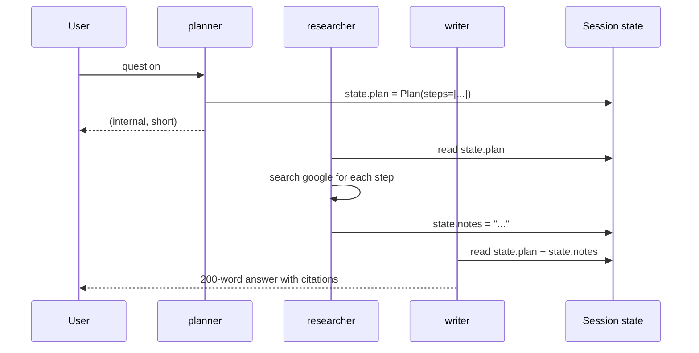

# Sequential agent

<span class="kicker">ch 03 · page 2 of 5</span>

Runs sub-agents in a fixed order. The ADK idiom for a multi-step
pipeline where order matters and branching does not.

---

## The build: planner → researcher → writer



```python
from pydantic import BaseModel
from google.adk.agents import LlmAgent, SequentialAgent
from google.adk.tools import google_search


class Plan(BaseModel):
    steps: list[str]

planner = LlmAgent(
    name="planner",
    model="gemini-3.1-pro-preview",
    instruction=(
        "Break the user's question into 3-5 specific research steps. "
        "Return JSON matching the Plan schema."),
    output_schema=Plan,
    output_key="plan",
)

researcher = LlmAgent(
    name="researcher",
    model="gemini-3-flash-preview",
    instruction=(
        "Execute each step in state['plan'].steps using google_search. "
        "Collect concise notes into state['notes']."),
    tools=[google_search],
    output_key="notes",
)

writer = LlmAgent(
    name="writer",
    model="gemini-3.1-pro-preview",
    instruction=(
        "Using state['notes'] and the user question, write a 200-word "
        "answer that cites each source inline."),
)

root_agent = SequentialAgent(
    name="deep_answer_pipeline",
    sub_agents=[planner, researcher, writer],
)
```

## How state flows between steps

The planner writes `state["plan"]`. The researcher reads it and
writes `state["notes"]`. The writer reads both. Nothing is passed
explicitly — the session carries it.



## When to prefer sequential over a single agent

- Steps use different models (pro for planning, flash for gathering).
- Steps have different tool sets (only the researcher has web search).
- You want evaluation at each step independently — you can replay
  just the writer against a known set of notes.
- You want retries at the step level, not the whole agent level.

## When *not* to use sequential

- When the branching is non-trivial. A `SequentialAgent` is always
  linear. For branching, wrap one step as an `LlmAgent` with
  sub-agents and let the model pick.
- When steps are truly independent. Use `ParallelAgent`.

## Stopping a sequential early

A sub-agent can emit `event.actions.escalate = True` to stop the
whole sequence. Implement this in a `before_agent_callback` or a
`CustomAgent` step:

```python
def stop_if_no_question(cc):
    if not cc.state.get("question"):
        # Returning Content finishes this agent; escalate stops the chain.
        cc.event_actions.escalate = True
        return types.Content(parts=[types.Part(text="Nothing to research.")])
```

---

## See also

- [`examples/03-sequential-workflow`](https://github.com/vmishra/Google-ADK-Cookbook/tree/main/examples/03-sequential-workflow)
- [Chapter 8 — Deep research](../08-deep-research/index.md) — a full
  planner/researcher/writer with memory.
