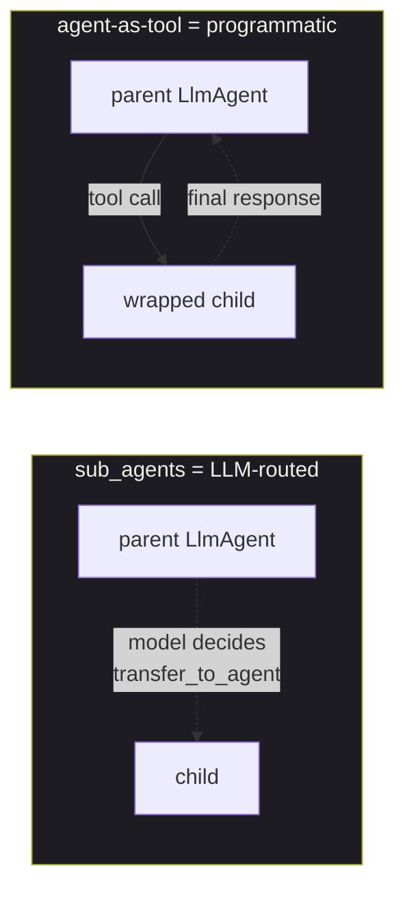

# Agent-as-tool

<span class="kicker">ch 04 · page 6 of 6</span>

Wrap an agent as a tool. The parent calls it like any other tool and
receives a single final response. Useful when you want hierarchical
control without the LLM-routed semantics of `sub_agents`.

---

## The distinction: sub_agents vs agent-as-tool



| Mechanism | Control flow |
|---|---|
| `sub_agents=[child]` | The parent's model decides when to transfer. The child may respond directly to the user. |
| `AgentTool(agent=child)` | The parent calls the child as a tool. The child runs to completion and returns a single string/dict to the parent. |

Use `AgentTool` when you want the parent to see the child as a
black-box capability — *"translate this to French"*, *"summarise this
PDF"* — rather than a collaborator.

## Example

```python
from google.adk.agents import LlmAgent
from google.adk.tools.agent_tool import AgentTool


translator = LlmAgent(
    name="translator",
    model="gemini-2.5-flash",
    instruction="Translate the input to French. Return only the translation.",
)


root_agent = LlmAgent(
    name="editor",
    model="gemini-2.5-pro",
    instruction="You write short blog posts. When a user wants French, use the translator tool.",
    tools=[AgentTool(agent=translator)],
)
```

The editor calls `translator` like a function. From the editor's
perspective, there is no difference between `translator` and any
other tool.

## Passing context

`AgentTool` runs the wrapped agent in its own sub-session derived
from the parent's. State writes the child makes are visible to the
parent through the sub-session's `state_delta`, but the child cannot
see `user:` or `app:` prefixes the parent has not surfaced.

For full context sharing, use `sub_agents` instead.

## When to use `AgentTool` vs `sub_agents`

- Use `AgentTool` when the child is a reusable skill.
- Use `sub_agents` when the child is a collaborator — it may
  respond directly, or bounce back to the parent.

---

## Chapter recap

Six tool types. You will typically use three: function, MCP, and
agent-as-tool. The other three are there when you need them.

Next: [Chapter 5 — Skills](../05-skills/index.md) — the Agent Skill
specification and how to package behaviours into reusable units.
