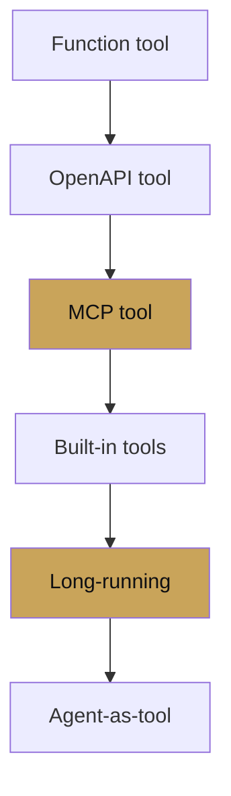

# Chapter 4 — Tools

chapter 04 · tools in depth

Worked examples for each tool category. Chapter 2 gave you the
contract; this chapter shows the hands.

| Page | Covers |
|---|---|
| [Function tools](function-tools.md) | Signatures, docstrings, `ToolContext`, error shapes |
| [OpenAPI tools](openapi-tools.md) | `OpenApiTool`, auth, operation ID mapping |
| [MCP tools](mcp-tools.md) | `MCPToolset`, stdio, SSE, streamable HTTP, dynamic headers |
| [Built-in tools](built-in-tools.md) | `google_search`, `VertexAiRagRetrieval`, `load_memory` |
| [Long-running tools](long-running-tools.md) | Human-in-the-loop, resumable sessions |
| [Agent-as-tool](agent-as-tool.md) | `AgentTool`, hierarchical delegation |
