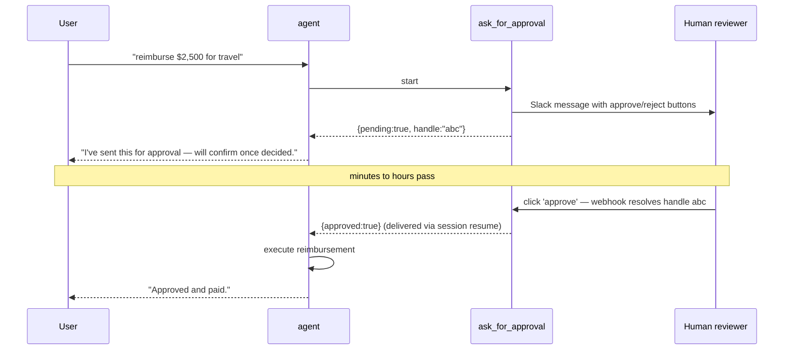

# Long-running tools

<span class="kicker">ch 04 · page 5 of 6</span>

A long-running tool is a tool that starts work and does not
necessarily complete in the same invocation. The agent is told *"the
tool is in progress"* and can either continue with other work or
pause. When the tool eventually returns, the session resumes.

This is ADK's primary human-in-the-loop mechanism.

---

## Shape

```python
from google.adk.tools.long_running_tool import LongRunningFunctionTool


def ask_for_approval(amount: float, reason: str) -> dict:
    """Ask a human to approve or reject a reimbursement.

    Returns a dict with a `pending` handle. The real decision arrives
    in a follow-up invocation via the session resume path.
    """
    handle = send_slack_approval_request(amount, reason)
    return {"pending": True, "handle": handle}


root_agent = LlmAgent(
    name="reimbursements",
    model="gemini-2.5-flash",
    tools=[reimburse, LongRunningFunctionTool(func=ask_for_approval)],
)
```

## The flow



## Resuming the session

When the human decision arrives — usually via a webhook — your
server code resolves the tool by looking up the handle, then resumes
the session:

```python
@app.post("/webhooks/slack-approval")
async def on_approval(body: dict):
    handle   = body["handle"]
    approved = body["approved"]
    session  = lookup_session_for(handle)
    resume_payload = {"approved": approved}
    async for ev in runner.resume_tool(
        session_id=session.id,
        user_id=session.user_id,
        handle=handle,
        response=resume_payload):
        ...
```

The `resume_tool` path tells the runner to deliver `resume_payload`
as the tool result and continue the agent. From the agent's
perspective, `ask_for_approval` just returned.

## `human_tool_confirmation`

A lighter-weight variant — blocks the agent in-process until a
confirmation arrives. Best for interactive dev UIs.

```python
from google.adk.tools.human_tool_confirmation import HumanToolConfirmation

root_agent = LlmAgent(
    name="safe_ops", model="gemini-2.5-flash",
    tools=[HumanToolConfirmation(wraps=delete_account)],
)
```

## When to reach for a long-running tool

- A human needs to approve before the agent proceeds.
- A tool really is slow (model training, long ETL). You do not want
  to hold the HTTP connection open.
- You are running the agent in a batch context and will resume it
  later with the results.

## Gotchas

- **Session persistence must be real.** In-memory sessions will lose
  long-running handles when the process restarts. Use
  `VertexAiSessionService` or `DatabaseSessionService`.
- **Handles must be unique.** Do not reuse them across sessions.
- **Webhook security.** The resume endpoint is a back door into
  session state. Authenticate it.

---

## See also

- `contributing/samples/human_in_loop`, `human_tool_confirmation`.
- [Chapter 14 — Approval flows](../14-safety/approval-flows.md).
