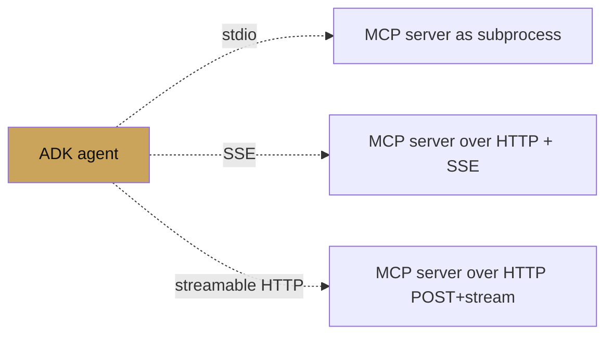

# MCP tools

<span class="kicker">ch 04 · page 3 of 6</span>

The Model Context Protocol (MCP) is the open standard for tool
servers. ADK's `MCPToolset` is a client that consumes any MCP server
over three transports: stdio, Server-Sent Events, or streamable
HTTP.

MCP is strategically important. Every major tool provider ships an
MCP server now — Notion, Slack, Google Drive, GitHub, Linear,
Postgres, BigQuery, Stripe. Using MCP means you spend zero time on
integration code.

---

## The three transports



- **stdio** — launch the server as a child process. Best for local
  dev and sandboxed environments.
- **SSE** — remote server over HTTP with Server-Sent Events for
  streaming. Good for long-lived remote services.
- **streamable HTTP** — newer transport that combines POST and
  streaming in one endpoint. Preferred for production.

## stdio example: Notion

```python
from google.adk.agents import LlmAgent
from google.adk.tools.mcp_tool.mcp_toolset import MCPToolset, StdioServerParameters
import os

notion_headers = (
    f'{{"Authorization": "Bearer {os.environ["NOTION_TOKEN"]}",'
    f' "Notion-Version": "2022-06-28"}}')

root_agent = LlmAgent(
    name="notion_agent",
    model="gemini-3.1-flash",
    instruction="You are my workspace assistant. Use the Notion tools.",
    tools=[MCPToolset(connection_params=StdioServerParameters(
        command="npx",
        args=["-y", "@notionhq/notion-mcp-server"],
        env={"OPENAPI_MCP_HEADERS": notion_headers}))],
)
```

On first call, ADK spawns `npx @notionhq/notion-mcp-server`, discovers
every tool the server exposes, and makes them available to the agent.
The process lifetime is managed by the runner.

## SSE example: remote server

```python
from google.adk.tools.mcp_tool.mcp_toolset import MCPToolset, SseServerParameters

tools = MCPToolset(connection_params=SseServerParameters(
    url="https://mcp.internal/bigquery/sse",
    headers={"Authorization": f"Bearer {token}"}))
```

## Streamable HTTP example

```python
from google.adk.tools.mcp_tool.mcp_toolset import (
    MCPToolset, StreamableHttpServerParameters)

tools = MCPToolset(connection_params=StreamableHttpServerParameters(
    url="https://mcp.internal/bigquery",
    headers={"Authorization": f"Bearer {token}"}))
```

## Dynamic headers

If the token must be refreshed per-request (e.g. per-user OAuth),
pass a callable:

```python
from google.adk.tools.mcp_tool.mcp_toolset import MCPToolset

def headers_for(ctx):
    return {"Authorization": f"Bearer {ctx.state['user:mcp_token']}"}

MCPToolset(
    connection_params=StreamableHttpServerParameters(url="https://..."),
    headers=headers_for,
)
```

See `contributing/samples/mcp_dynamic_header_agent` for the full
pattern.

## Selecting a subset of tools

An MCP server may expose many tools. Use `tool_filter` to expose only
the ones the agent needs:

```python
MCPToolset(
    connection_params=...,
    tool_filter=lambda tool: tool.name in {"search_pages", "create_page"},
)
```

This keeps the model's prompt surface narrow, which improves tool
selection accuracy and reduces token cost.

## Service-account auth

For MCP servers that accept a Google service account (e.g.
BigQuery's official MCP server):

```python
from google.adk.tools.mcp_tool.mcp_toolset import MCPToolset, StdioServerParameters

MCPToolset(
    connection_params=StdioServerParameters(
        command="npx", args=["-y", "@google/bigquery-mcp"],
        env={"GOOGLE_APPLICATION_CREDENTIALS": "/path/to/sa.json"}))
```

See `mcp_service_account_agent` for specifics.

---

## Exposing an ADK agent as an MCP server

The inverse direction: any ADK agent can be exposed via MCP so that
non-ADK tools can use it. Use `adk api_server --mcp-port 8081`, or
build a small FastAPI server that wraps the agent as an MCP endpoint.
Full pattern in `mcp_stdio_server_agent`.

---

## See also

- `contributing/samples/mcp_*` (eleven samples in `google/adk-python`).
- [Model Context Protocol spec](https://modelcontextprotocol.io/).
- [Chapter 16 — Interop](../16-interop/mcp.md).
