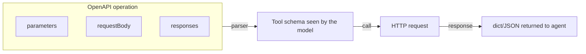

# OpenAPI tools

<span class="kicker">ch 04 · page 2 of 6</span>

Any REST API described by an OpenAPI 3.x spec becomes a set of tools
with one import.

---

## Quick start

```python
from google.adk.tools.openapi_tool.openapi_spec_parser import OpenApiTool

billing = OpenApiTool(
    spec_path="./billing.yaml",   # or spec_url="https://.../openapi.yaml"
    auth_scheme="bearer",
    bearer_token_env="BILLING_TOKEN",
)

root_agent = LlmAgent(
    name="ops",
    model="gemini-2.5-flash",
    tools=[billing],
    instruction="Use billing API to answer invoice questions.",
)
```

Each `operationId` in the spec becomes a tool. If your spec defines
`listInvoices`, `getInvoice`, `markInvoicePaid`, the agent sees three
tools with those exact names.

## Operation shape → tool schema



- Path + query + header parameters → top-level tool args.
- Request body → nested object arg.
- Response schema → the return type shape.
- Operation `summary` / `description` → tool description.

Write good operation descriptions in your OpenAPI spec. The model
reads them.

## Auth schemes

| Scheme | Config |
|---|---|
| `"none"` | Nothing to do. |
| `"api_key"` | `api_key_env="MYKEY"` or `api_key=…` literal. |
| `"bearer"` | `bearer_token_env="MYTOKEN"`. |
| `"oauth2"` | Pass an `auth_config` with client id/secret/scopes; integrates with `CredentialService`. |

For production OAuth flows, use the `oauth2_client_credentials` and
`oauth_calendar_agent` samples as references. ADK routes auth prompts
through the `CredentialService` so tokens are stored and refreshed
without the agent knowing.

## Server URL selection

If the spec has multiple servers, pick one:

```python
OpenApiTool(spec_path="./api.yaml", server_url="https://api.prod.example.com")
```

## Rate limiting

OpenAPI tools do not come with rate limiting. Add a plugin or wrap
the spec load in a custom subclass:

```python
class RateLimitedOpenApiTool(OpenApiTool):
    def __init__(self, *args, rps: float = 5.0, **kwargs):
        super().__init__(*args, **kwargs)
        self._bucket = TokenBucket(rps)

    async def _execute(self, ...):
        await self._bucket.acquire()
        return await super()._execute(...)
```

## When to prefer OpenAPI over a function tool

- You already have a documented API. Do not rewrite its schema by
  hand.
- You want the model to know about many endpoints. A spec with 20
  operations is cleaner than 20 hand-written tools.

## When *not* to

- The API is small (1–3 endpoints) and the spec is worse than the
  hand-written version.
- You need fine-grained pre-processing or post-processing per
  endpoint. Function tools are easier to curate.

---

## See also

- [`examples/02-tool-calling`](https://github.com/vmishra/Google-ADK-Cookbook/tree/main/examples/02-tool-calling)
- `contributing/samples/api_registry_agent`, `google_api` in
  `google/adk-python`.
