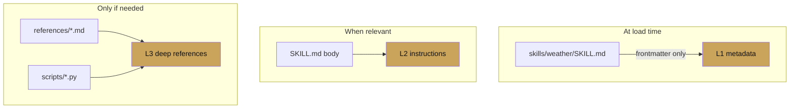

# Chapter 5 — Skills

chapter 05 · the agent skill spec

Skills are packaged units of agent behaviour. A skill is a directory
with a `SKILL.md` at the top level, optional `references/`, `assets/`,
and `scripts/` subdirectories, and the Agent Skill specification
describes the format.

The point of skills is *progressive disclosure*: the model sees a
one-line description until a skill becomes relevant, then reads the
body, then — only if needed — reads individual references. The token
cost stays proportional to what is actually used.

---

## Why skills exist

A monolithic instruction that covers every task the agent might do
will be long, unfocused, and expensive. A per-skill structure:

- lets the model pull in only what it needs,
- lets non-engineers edit behaviour by editing Markdown,
- turns reusable behaviours into version-controllable artefacts,
- crosses language/tool boundaries (the spec is language-agnostic).

---

## Pages

| Page | Covers |
|---|---|
| [Authoring a skill](authoring.md) | `SKILL.md` format, file layout, first skill |
| [Progressive disclosure](progressive-disclosure.md) | L1 → L2 → L3 pattern and token budgeting |
| [Skill patterns](skill-patterns.md) | Common templates and anti-patterns |
