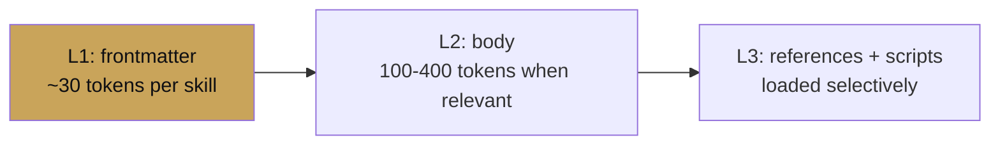

# Progressive disclosure

<span class="kicker">ch 05 · page 2 of 3</span>

Skills load in three layers. This page is a tour of the layers and
how to budget token cost against them.

---

## The three layers



- **L1 — Frontmatter.** `name` + `description`. Always in context.
- **L2 — Body.** The `SKILL.md` body. Loaded when the model
  decides the skill is relevant (typically after the user's first
  on-topic message).
- **L3 — References and scripts.** Loaded by explicit request —
  either a tool call from the skill body or by the model reading
  them via a file-loader tool.

The key idea: **you can ship an agent with 50 skills and pay the
token cost of 50 one-line descriptions, not 50 full bodies.**

## A token-budget example

Suppose your agent has ten skills, each with a 300-token body and
four 500-token references.

| Scenario | Tokens in context |
|---|---|
| Monolithic instruction with all content | 10×(300 + 4×500) = 23,000 |
| Skills, nothing triggered | 10×30 = 300 |
| Skills, one body triggered | 300 + 300 = 600 |
| Skills, one body + two references | 300 + 300 + 2×500 = 1,600 |

Progressive disclosure is not a minor optimisation. It is the
difference between a 4-cent turn and a 0.3-cent turn.

## When to split a body into references

- The body itself is longer than 400 tokens. Split off the less
  frequently-needed parts.
- A section is consulted *only* in specific sub-cases ("how to handle
  the Europe tax case"). Make it a reference and cross-link.
- An example set is long (3+ examples of 30+ tokens each). References.

## When *not* to split

- The body is short and cohesive. Splitting a 200-token body adds
  indirection for no gain.
- The "reference" would only be read in conjunction with the rest of
  the body. Keep it inline.

## Script as tool

A file in `scripts/` is an executable the skill can call. Make it
self-documenting:

```python
#!/usr/bin/env python
"""
scripts/fahrenheit_to_celsius.py

Usage: python fahrenheit_to_celsius.py <temp_f>
"""
import sys
f = float(sys.argv[1])
print(round((f - 32) * 5/9, 2))
```

The skill body refers to it:

```markdown
For F → C conversion, run `scripts/fahrenheit_to_celsius.py`
with the Fahrenheit value.
```

The `SkillToolset`'s `code_executor` runs it. This keeps
computation out of the model's head.

---

## Debugging skill selection

The dev UI shows which skills loaded in each turn. If a skill is
being loaded unnecessarily, tighten its description. If it is not
being loaded when it should, the description is too narrow — add
phrases the user might use.

The description is the model's only signal for relevance at L1.
Treat it like a search-engine snippet.

---

## See also

- [Skill patterns](skill-patterns.md) — common templates.
