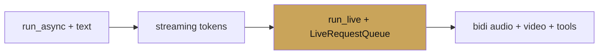

# Chapter 6 — Multimodal & Live

chapter 06 · voice, vision, real-time

Voice and real-time are where ADK's integration with Gemini Live pays
off. The same agent you wrote for text responds to audio, streams
partial output, handles interruptions, and transcribes — by swapping
the model and calling `run_live` instead of `run_async`.

This chapter walks through the live API, voice agents end-to-end,
streaming fundamentals, vision, and the bidirectional protocol.

| Page | Covers |
|---|---|
| [Live API](live-api.md) | The Gemini Live API, models, modalities, setup |
| [Voice agents](voice-agents.md) | Full voice agent with WebSocket UI |
| [Streaming](streaming.md) | SSE and token streaming in text flows |
| [Vision](vision.md) | Images and PDFs as tool inputs and parts |
| [Realtime bidi](realtime-bidi.md) | The bidirectional protocol, interruption |
