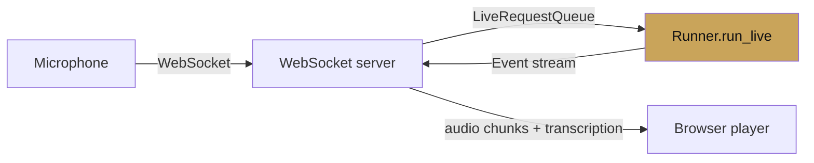

# Live API

<span class="kicker">ch 06 · page 1 of 5</span>

The Gemini Live API gives an agent native audio in and out, video
in, interruption handling, automatic transcription, and tool calling
— in a single bidirectional stream. ADK wraps all of it behind
`runner.run_live()`.

---

## The two live models

| Path | Model ID |
|---|---|
| Vertex AI | `gemini-live-2.5-flash-native-audio` |
| Gemini API | `gemini-2.5-flash-native-audio-preview-12-2025` |

Both are Flash-tier. "Native audio" means the model generates audio
directly — you do not pipe text through a TTS layer.

## Setup

```python
from google.adk.agents import LlmAgent

root_agent = LlmAgent(
    name="voice_agent",
    model="gemini-live-2.5-flash-native-audio",   # Vertex path
    instruction=(
        "You answer out loud, briefly, in a calm voice. "
        "Use tools when the answer requires one."),
    tools=[get_weather, remember_city],
)
```

The agent definition is unchanged from a text agent. The model swap
is the only required difference.

## Running live

```python
from google.adk.runners import InMemoryRunner
from google.adk.agents import LiveRequest, LiveRequestQueue, RunConfig
from google.genai import types


runner = InMemoryRunner(agent=root_agent, app_name="voice")
session = await runner.session_service.create_session(
    app_name="voice", user_id="u1")
queue = LiveRequestQueue()


run_config = RunConfig(
    response_modalities=["AUDIO"],
    speech_config=types.SpeechConfig(
        voice_config=types.VoiceConfig(
            prebuilt_voice_config=types.PrebuiltVoiceConfig(voice_name="Aoede"))),
    output_audio_transcription=types.AudioTranscriptionConfig(),
    input_audio_transcription=types.AudioTranscriptionConfig(),
)


async def producer():
    # push audio chunks from the microphone
    async for chunk in mic_stream():
        await queue.send_content(types.Content(parts=[types.Part(
            inline_data=types.Blob(mime_type="audio/pcm", data=chunk))]))
    await queue.close()


async def consumer():
    async for event in runner.run_live(
        user_id="u1", session_id=session.id,
        live_request_queue=queue, run_config=run_config):
        # event.content.parts may include audio bytes, text, or transcription
        yield event


await asyncio.gather(producer(), consumer())
```

## What you get for free

- **Interruption.** When the user starts speaking, the agent stops
  speaking. ADK tracks this over `turn_complete`.
- **Transcription.** Input and output audio is transcribed
  automatically (configure with `AudioTranscriptionConfig`).
- **Tool calls mid-conversation.** The model can call tools during a
  live session; the result is streamed back in.
- **Session continuity.** Events are still recorded, so you can
  replay the session from its event log later.

## Voice options

Prebuilt voices available at time of writing: `Aoede`, `Puck`,
`Charon`, `Kore`, `Fenrir`. Pick based on the product's voice
(Aoede is the conservative default).

## Latency notes

- Round-trip from voice in to voice out hovers around 500ms–900ms
  end-to-end on a good connection.
- Tool calls add the tool's latency + one extra round-trip.
- Keep the instruction short. Long system instructions add cost per
  turn because they are re-sent.

## Server architecture



The canonical production pattern: a FastAPI WebSocket endpoint that
bridges the browser's audio to ADK's `LiveRequestQueue`, yielding
events back to the browser for playback. The
[`voice-agents`](voice-agents.md) page builds this from scratch.

---

## See also

- `contributing/samples/live_bidi_streaming_single_agent`,
  `live_agent_api_server_example`, `speech_to_text_agent` in
  `google/adk-python`.
- [Chapter 18 — Voice concierge case study](../18-case-studies/voice-concierge.md).
