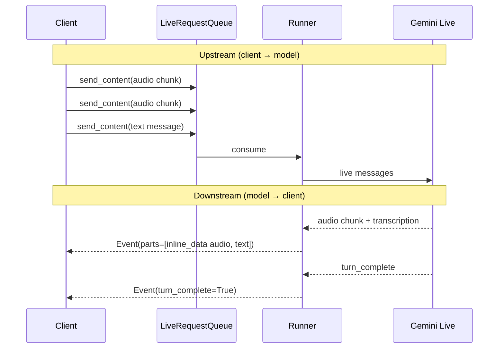

# Realtime bidi

<span class="kicker">ch 06 · page 5 of 5</span>

The bidirectional streaming protocol in detail: what goes up, what
comes down, and how interruption actually works.

---

## The up and down streams



Everything is framed as `Part`s on either side. The runtime handles
framing, heartbeats, and reconnection.

## Interruption

A key capability of Gemini Live: when the user speaks while the
agent is speaking, the agent stops. ADK signals this to your
consumer as `event.interrupted=True`, and any queued audio
chunks on the client should be discarded.

```python
async for event in runner.run_live(...):
    if event.interrupted:
        cancel_playback()
        continue
    for part in event.content.parts:
        if part.inline_data:
            enqueue_audio(part.inline_data.data)
```

On the UI side, you cancel the current audio source and clear any
buffered chunks. Not doing this causes an interrupted agent to
continue speaking the stale response over the user.

## Tool calls during a live turn

Tool calls in live mode work the same way they do in text mode — the
model emits a tool-call event, the runner executes the tool, the
result flows back, the model resumes. All of it happens without
leaving the live session.

The user may notice a brief pause while a tool runs. Keep live-mode
tools fast; push long-running work to a long-running tool instead
(which pauses the session gracefully).

## Session resumption

Live sessions survive client disconnects. If the client reconnects
before the session is garbage collected, you can resume with the
same `session_id` and pick up where you left off.

```python
run_config = RunConfig(
    response_modalities=["AUDIO"],
    session_resumption=types.SessionResumptionConfig(handle=previous_handle),
    ...)
```

See the `live_bidi_debug_utils` sample for the resume mechanics.

## Context compression

Live sessions can run long. ADK will compress the context
automatically when it approaches the model's window:

```python
run_config = RunConfig(
    context_window_compression=types.ContextWindowCompressionConfig(
        trigger_tokens=800_000,
        sliding_window=types.SlidingWindow(target_tokens=600_000)),
    ...)
```

[Chapter 15 — Cost & latency](../15-cost-latency/index.md) goes into
when to tune these.

---

## Chapter recap

Voice and vision are not a separate framework. They are the same
agent with a different model and a different entry point.

Next: [Chapter 7 — Computer use](../07-computer-use/index.md) —
where the agent stops talking and starts operating a real browser.
