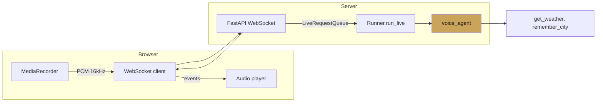

# Voice agents

<span class="kicker">ch 06 · page 2 of 5</span>

A production voice agent: FastAPI WebSocket server, browser client,
Gemini Live, tools. The complete version lives at
[`examples/12-voice-assistant-live`](https://github.com/vmishra/Google-ADK-Cookbook/tree/main/examples/12-voice-assistant-live).

---

## Topology



## Server

```python
# server.py
import asyncio, json, base64
from fastapi import FastAPI, WebSocket
from google.adk.runners import InMemoryRunner
from google.adk.agents import LiveRequestQueue, RunConfig
from google.genai import types
from voice_agent.agent import root_agent

app = FastAPI()
runner = InMemoryRunner(agent=root_agent, app_name="voice")


@app.websocket("/stream")
async def stream(ws: WebSocket):
    await ws.accept()
    session = await runner.session_service.create_session(
        app_name="voice", user_id="web")
    queue = LiveRequestQueue()
    cfg = RunConfig(
        response_modalities=["AUDIO"],
        speech_config=types.SpeechConfig(
            voice_config=types.VoiceConfig(
                prebuilt_voice_config=types.PrebuiltVoiceConfig(voice_name="Aoede"))),
        input_audio_transcription=types.AudioTranscriptionConfig(),
        output_audio_transcription=types.AudioTranscriptionConfig(),
    )

    async def from_browser():
        while True:
            msg = await ws.receive_json()
            if msg["type"] == "audio":
                data = base64.b64decode(msg["data"])
                await queue.send_content(types.Content(parts=[types.Part(
                    inline_data=types.Blob(mime_type="audio/pcm", data=data))]))
            elif msg["type"] == "end":
                await queue.close(); break

    async def to_browser():
        async for event in runner.run_live(
            user_id="web", session_id=session.id,
            live_request_queue=queue, run_config=cfg):
            if event.content and event.content.parts:
                for part in event.content.parts:
                    if part.inline_data:
                        await ws.send_json({"type": "audio",
                            "data": base64.b64encode(part.inline_data.data).decode()})
                    elif part.text:
                        await ws.send_json({"type": "text", "data": part.text})
            if event.turn_complete:
                await ws.send_json({"type": "turn_complete"})

    await asyncio.gather(from_browser(), to_browser())
```

## Browser client (sketch)

```javascript
const ws = new WebSocket("wss://your.host/stream");
ws.binaryType = "arraybuffer";

const ctx = new AudioContext({ sampleRate: 16000 });
const mic = await navigator.mediaDevices.getUserMedia({ audio: true });
const source = ctx.createMediaStreamSource(mic);
const processor = ctx.createScriptProcessor(4096, 1, 1);
processor.onaudioprocess = e => {
  const pcm16 = floatTo16BitPCM(e.inputBuffer.getChannelData(0));
  ws.send(JSON.stringify({
    type: "audio",
    data: btoa(String.fromCharCode(...new Uint8Array(pcm16.buffer))),
  }));
};
source.connect(processor); processor.connect(ctx.destination);

ws.onmessage = async m => {
  const msg = JSON.parse(m.data);
  if (msg.type === "audio") playChunk(base64ToPcm(msg.data));
  if (msg.type === "text")  showCaption(msg.data);
};
```

## Things to get right

- **Frame the audio correctly.** 16kHz PCM, little-endian, mono.
  Anything else and the model will behave unpredictably.
- **Handle interruption on the client.** When you receive a new
  `audio` event after the user has started speaking, cancel the
  currently-playing buffer.
- **Surface transcription.** Showing the user their own transcribed
  speech and the agent's transcribed response in real time is the
  single highest-leverage UX decision.
- **Send `end` when the stream closes.** Otherwise the server hangs
  on `queue.close()`.

---

## See also

- `contributing/samples/live_agent_api_server_example` — the
  reference server.
- `contributing/samples/websocket_agent` — simpler WebSocket
  example.
