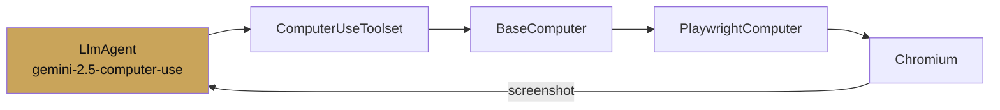

# Chapter 7 — Computer use

chapter 07 · browser automation with gemini

Computer use is the model category where Gemini most obviously leads.
`gemini-2.5-computer-use-preview-10-2025` is trained to operate a
browser — read pixels, move a mouse, type, click, and reason about
what is on screen — and ADK wires it up through a `ComputerUseToolset`
backed by a `BaseComputer` implementation (Playwright by default).

This chapter covers when to reach for it, how to wire it up safely,
and the approval flow that keeps a destructive mistake survivable.

| Page | Covers |
|---|---|
| [Browser automation](browser-automation.md) | Full agent + Playwright setup |
| [Safety loops](safety-loops.md) | Approval card, domain allowlist, sandboxing |
