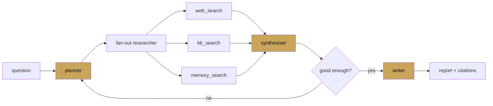

# Chapter 8 — Deep research

chapter 08 · long-horizon, multi-step research agents

A "deep research" agent is what you get when you give a planner-led
sequential workflow access to search, memory, and several generations
of refinement. This chapter builds one from scratch and explains the
decisions that separate a solid deep researcher from a brittle one.

| Page | Covers |
|---|---|
| [Planner/researcher/writer](planner-researcher-writer.md) | The full pipeline with code |
