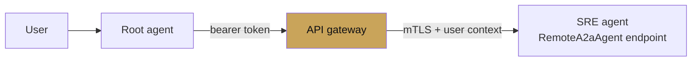

# A2A federation

<span class="kicker">ch 09 · page 3 of 3</span>

Agent-to-Agent (A2A) is an open protocol for agents running in
different processes, repos, and organisations to call each other.
ADK ships both sides: `RemoteA2aAgent` consumes remote agents, and a
small server wrapper exposes any ADK agent over A2A.

The protocol specification lives at [`a2a-protocol.org`](https://a2a-protocol.org/).
It is not Google-specific — LangGraph, CrewAI, and others can
implement it too, which is the point.

---

## The agent card

Every A2A-exposed agent has an agent card — a JSON document at a
well-known URL that describes the agent, its capabilities, its auth,
and the transport. Consumers fetch the card and call the agent
accordingly.

```json
{
  "name": "sre_incident_agent",
  "description": "Reads alerts and suggests mitigations.",
  "capabilities": ["streaming", "tools"],
  "authentication": {"type": "bearer"},
  "endpoints": {
    "invoke": "https://sre.internal/a2a/invoke",
    "stream": "https://sre.internal/a2a/stream"
  }
}
```

## Consuming a remote agent

```python
from google.adk.agents import LlmAgent
from google.adk.agents.remote_a2a_agent import RemoteA2aAgent

sre = RemoteA2aAgent(
    name="sre",
    agent_card="https://sre.internal/a2a/agent-card",
    auth_header_provider=lambda ctx: f"Bearer {ctx.state['user:a2a_token']}",
)

root = LlmAgent(
    name="root",
    model="gemini-2.5-flash",
    sub_agents=[sre, other_local_agent],
    instruction="Transfer SRE questions to sre; handle everything else.",
)
```

From the root's perspective, `sre` is a sub-agent like any other.
Under the hood, each invocation becomes an HTTP call to the A2A
endpoint.

## Exposing an ADK agent over A2A

The `adk api_server` CLI supports A2A out of the box:

```bash
adk api_server --a2a --agents agents.sre_incident \
  --port 8443 \
  --session_service_url postgres://...
```

It produces:

- `GET  /a2a/<agent>/.well-known/agent-card` — the card.
- `POST /a2a/<agent>/invoke` — one-shot invocation.
- `POST /a2a/<agent>/stream` — streaming invocation.

For production, put it behind your gateway — mTLS or IAP, per-tenant
tokens, rate limits.

## Auth patterns



Three layers:

1. **User to root** — whatever your app auth is.
2. **Root to gateway** — service account or per-user bearer.
3. **Gateway to agent** — mTLS in a private network, or IAP.

## Across frameworks

The A2A protocol is the lever for framework-agnostic composition.
A LangGraph agent exposing A2A and a CrewAI agent exposing A2A both
look identical to an ADK `RemoteA2aAgent` consumer. The
[Chapter 16 — Interop](../16-interop/a2a.md) pages cover how to
wrap a non-ADK agent as an A2A endpoint.

## Discoverability

For large fleets, add a registry:

- **Agent registry** — a service that lists agent cards by name and
  capability. See `contributing/samples/agent_registry_agent`.
- **API registry** — for OpenAPI tools, the
  `api_registry_agent` sample shows the pattern.

The root agent can query the registry to discover new agents at
runtime instead of hard-wiring endpoints.

---

## Federation anti-patterns

- **Fan-out federation without timeouts.** One slow remote agent
  stalls the parallel step. Always set timeouts on `RemoteA2aAgent`.
- **Hard-coded agent URLs.** Use a registry or DNS-based
  service discovery.
- **Shared service accounts across tenants.** Use per-tenant
  identities so audit logs are useful.

---

## See also

- `contributing/samples/a2a_basic`, `a2a_auth`, `a2a_human_in_loop`,
  `a2a_root` in `google/adk-python`.
- [`examples/14-a2a-federation`](https://github.com/vmishra/Google-ADK-Cookbook/tree/main/examples/14-a2a-federation).
