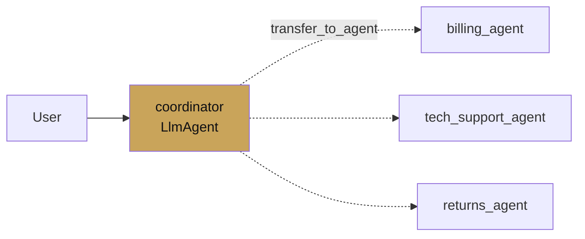

# Coordinator pattern

<span class="kicker">ch 09 · page 1 of 3</span>

A coordinator is an `LlmAgent` that routes to named sub-agents. The
model decides which sub-agent is best for the user's request, ADK
transfers control, and the sub-agent responds.

---

## Shape



## Code

```python
from google.adk.agents import LlmAgent

billing = LlmAgent(
    name="billing",
    model="gemini-3.1-flash",
    description="Answers questions about invoices, charges, and refunds.",
    instruction="...",
    tools=[lookup_invoice, mark_paid],
)

tech = LlmAgent(
    name="tech_support",
    model="gemini-3.1-flash",
    description="Diagnoses technical problems with the product.",
    instruction="...",
    tools=[lookup_logs, restart_service],
)

returns = LlmAgent(
    name="returns",
    model="gemini-3.1-flash",
    description="Handles return requests and RMA processing.",
    instruction="...",
    tools=[start_return, check_return_status],
)

root_agent = LlmAgent(
    name="coordinator",
    model="gemini-3.1-flash",
    description="Routes the user to the correct specialist.",
    instruction=(
        "You are the front desk. Classify the user's request, then "
        "transfer to billing, tech_support, or returns. Do not "
        "answer technical questions yourself."),
    sub_agents=[billing, tech, returns],
)
```

## How routing actually works

The coordinator's model is told about its sub-agents as named
targets it can transfer to. When it decides to hand off, it emits a
special transfer action; ADK stops the coordinator and runs the
named sub-agent with the same session and input.

The sub-agent responds directly to the user. The coordinator does
not re-wrap the response.

## Descriptions are the dispatch key

The coordinator's model routes based on each sub-agent's
`description`. Write descriptions like a dispatcher's index entry:

```python
description = "Answers questions about invoices, charges, and refunds."
```

Not:

```python
description = "A billing agent."
```

The first is specific enough for the model to pick confidently; the
second is not.

## Coordinator vs AgentTool

- **Use `sub_agents`** when the sub-agent should respond directly
  and the coordinator may legitimately not know the answer.
- **Use `AgentTool`** when the coordinator should synthesise the
  sub-agent's output before replying.

## Two-level coordinators

Coordinators nest:

```python
shopping = LlmAgent(name="shopping", sub_agents=[search, cart, checkout])
support  = LlmAgent(name="support",  sub_agents=[billing, tech, returns])
root     = LlmAgent(name="root",     sub_agents=[shopping, support])
```

The dev UI shows the nesting as a tree. Keep it shallow (≤3 levels)
for legibility — deeper hierarchies are usually a sign that an
agent-as-tool or a skill would be cleaner.

---

## See also

- `contributing/samples/multi_agent_basic_config`, `hello_world_ma`.
- [`examples/07-multi-agent-coordinator`](https://github.com/vmishra/Google-ADK-Cookbook/tree/main/examples/07-multi-agent-coordinator).
