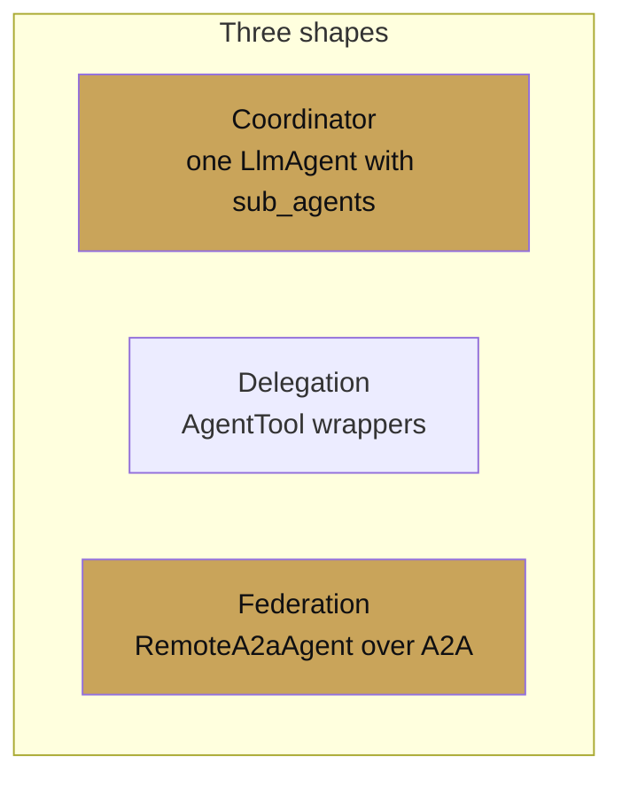

# Chapter 9 — Multi-agent systems

chapter 09 · coordination across agents

Real systems have more than one agent. This chapter covers the three
shapes ADK gives you for multi-agent coordination and when to reach
for each.

| Page | Covers |
|---|---|
| [Coordinator pattern](coordinator.md) | One router, many workers |
| [Delegation](delegation.md) | Agents-as-tools, scoped capabilities |
| [A2A federation](a2a-federation.md) | Cross-process agents over the open A2A protocol |
