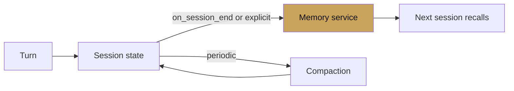

# Chapter 10 — Memory patterns

chapter 10 · state, memory, compaction

Chapter 2 introduced the primitives. This chapter is the recipes —
what lives where, when to move data between layers, and how to keep
long-running sessions from drowning in their own history.

| Page | Covers |
|---|---|
| [Session state](session-state.md) | Prefixes, lifetimes, who writes what |
| [Vertex Memory Bank](vertex-memory-bank.md) | Production long-term memory |
| [Compaction](compaction.md) | Keeping long sessions cheap |
