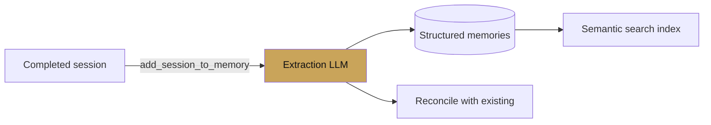

# Vertex Memory Bank

<span class="kicker">ch 10 · page 2 of 3</span>

`VertexAiMemoryBankService` is the managed long-term memory ADK
ships. It is different from a vector store in one important way:
**it extracts memories**, rather than dumping every turn.

---

## What "extraction" means



When you call `add_session_to_memory`, the service hands the session
to a small LLM whose job is to:

1. Identify facts worth remembering (preferences, relationships,
   decisions, artifacts). Drop chit-chat.
2. Reconcile with existing memories for the same user — merge
   updates, deprecate stale facts.
3. Index the resulting memories semantically.

This keeps the memory store compact and — importantly — legible.
You can read a user's memory bank and it looks like notes a
colleague might write.

## Setup

```bash
# In Vertex AI, create an Agent Engine (gets you the engine id).
gcloud ai agent-engines create --display-name support-bot --region us-central1
```

```python
from google.adk.memory import VertexAiMemoryBankService

memory = VertexAiMemoryBankService(
    project="my-project",
    location="us-central1",
    agent_engine_id="1234567890",
)
```

Wire it onto the runner:

```python
runner = Runner(
    agent=root_agent,
    session_service=session_svc,
    memory_service=memory,
    artifact_service=artifact_svc,
)
```

## When to ingest

Three options, by control level:

1. **After every session.** Simple. Wasteful if sessions are short
   and information-poor.
2. **After every N turns.** `after_agent_callback` that checks
   `turn_count % N == 0`.
3. **Explicit save tool.** A `save_to_memory(what: str)` function
   the model calls when it decides something is worth remembering.
   Most selective, best signal/noise.

```python
from google.adk.tools.tool_context import ToolContext

async def save_to_memory(note: str, tool_context: ToolContext) -> dict:
    """Save a single note to the user's long-term memory."""
    await tool_context._invocation_context.memory_service.add_session_to_memory(
        tool_context._invocation_context.session)
    return {"ok": True}
```

## Reading

Two approaches from Chapter 2 apply here:

```python
from google.adk.tools.load_memory_tool import load_memory_tool
from google.adk.tools.preload_memory_tool import preload_memory_tool
```

- `preload` — injected at the start of every turn. Higher token
  cost per turn, but the model always has relevant context.
- `load_memory` — called on demand. Lower per-turn cost, but the
  model might not realise it should check memory.

Rule of thumb: `preload` for assistants that are inherently
memory-dependent (personal assistants, coaching), `load_memory` for
transactional agents (support, ops).

## Other memory services

- `InMemoryMemoryService` — keyword-matched, process-lifetime.
  Tests only.
- `VertexAiRagMemoryService` — use an existing Vertex RAG corpus as
  a memory source. Useful when you have a documentation corpus you
  want the agent to recall.

---

## See also

- `contributing/samples/memory` — full example.
- [`examples/06-memory-backed-assistant`](https://github.com/vmishra/Google-ADK-Cookbook/tree/main/examples/06-memory-backed-assistant).
