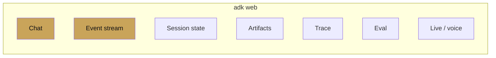

# Dev UI

ch 11 · page 2 of 2

The `adk web` dev UI is the fastest path from a broken agent to a
fixed one. This page lists what it shows and how to get the most
out of it.

---

## Panes

- **Chat** — normal conversation.
- **Event stream** — every event with tool calls, transfers,
  `state_delta`, and timestamps. Click an event to see the raw JSON.
- **Session state** — current state tree, with prefix coloring.
- **Artifacts** — every artifact the session has touched, with
  version history.
- **Trace** — OTel spans rendered as a flame graph.
- **Eval** — create a `.test.json` from the current session;
  re-run saved tests.
- **Live** — open a bidi stream if the agent's model supports live.

## Debugging patterns

- **Wrong tool called?** Open the event, see the model's
  `function_call` args. 80% of the time the fix is in the tool's
  docstring.
- **State write missing?** Check the event's `state_delta`. If it
  is empty, the tool did not write through `tool_context.state`.
- **Hallucinated fact?** Open the trace. If the model produced the
  fact without a grounding tool call, your instruction needs to
  insist on grounding.
- **Slow turn?** Trace shows which span dominated. Usually it is
  a slow tool, not the model.

## Saving sessions

Every session in the dev UI is saveable as JSON. Save a handful of
interesting ones (happy path, edge case, failure) as `.test.json`
eval cases — the dev UI has a button for this under the Eval tab.

## When to leave the dev UI

Two signs you have outgrown it:

- You are testing scenarios that involve two users or federation.
  The dev UI is one user per tab; use `adk api_server` + a real
  client.
- You need trace history across many runs. The dev UI shows the
  trace of the current session; for aggregates, go to Cloud Trace.

---

## See also

- [Tracing](tracing.md)
- [Chapter 12 — Evaluation](../12-evaluation/index.md).
