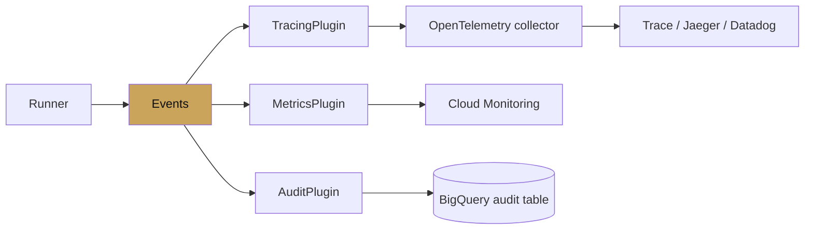

# Chapter 11 — Observability

chapter 11 · tracing, logging, the dev ui

Observability for agents is observability for event streams. Because
ADK treats every interesting thing as an `Event` with a structured
shape, instrumenting is a matter of attaching plugins and exporters —
not wrapping every call site.

---

## What you can observe

| Signal | Where it comes from | Where it goes |
|---|---|---|
| Tokens / tool calls / transfers | Event stream | Dev UI, OTel traces, BigQuery via plugin |
| Latency per span | OTel instrumentation | Cloud Trace, Jaeger, Datadog |
| Cost per invocation | Model metadata + token counts | Log-based metric in Cloud Monitoring |
| State changes | `event.actions.state_delta` | Audit log |
| Errors | Exceptions caught by plugins | Sentry, Error Reporting |

## Pages

| Page | Covers |
|---|---|
| [Tracing](tracing.md) | OTel setup, Cloud Trace, custom spans |
| [Dev UI](dev-ui.md) | What the built-in UI shows; when to stop adding prints |

