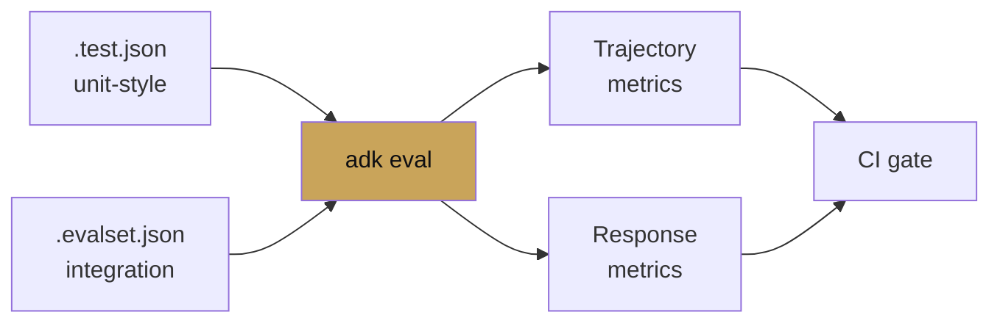

# Chapter 12 — Evaluation

chapter 12 · eval sets, metrics, CI

Agent evaluation is trajectory + response. Did the agent call the
right tools in the right order, and did its final output meet the
bar. ADK ships both kinds and a CLI that runs them.

| Page | Covers |
|---|---|
| [Eval sets](eval-sets.md) | Writing `.test.json` and `.evalset.json` |
| [Metrics](metrics.md) | Trajectory and response metrics in detail |
| [CI integration](ci-integration.md) | GitHub Actions and Cloud Build gates |
