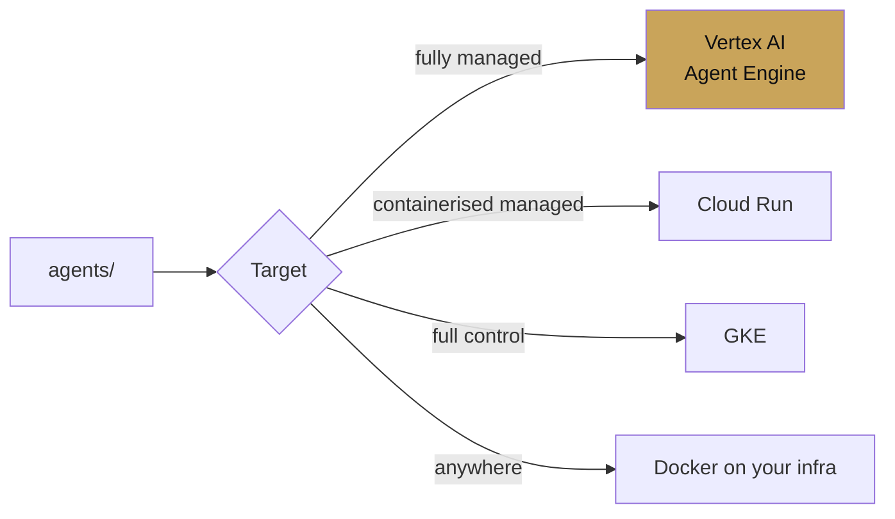

# Chapter 13 — Deployment

chapter 13 · from laptop to production

Three managed targets and one self-hosted path. Same agent, same
`root_agent` variable, different packaging.

| Page | Covers |
|---|---|
| [Agent Engine](agent-engine.md) | Vertex AI's managed runtime |
| [Cloud Run](cloud-run.md) | Containerised serverless |
| [GKE](gke.md) | Kubernetes for control and sandboxing |

## Deciding

Rules of thumb:

- **Start with Agent Engine.** It is the lowest-overhead path, and
  it is the target `adk deploy agent_engine` is tuned for. You
  lose control over a few runtime knobs but gain session and memory
  services that are managed.
- **Pick Cloud Run** if you need custom routing, websockets for
  live voice, or if you already run the rest of your service there.
- **Pick GKE** if you need custom sandboxes (computer use, code
  execution), per-tenant isolation, or strict network policy.
- **Self-host** when the above are not available (air-gapped, on-prem,
  other cloud). Container + FastAPI entry point — no surprises.
