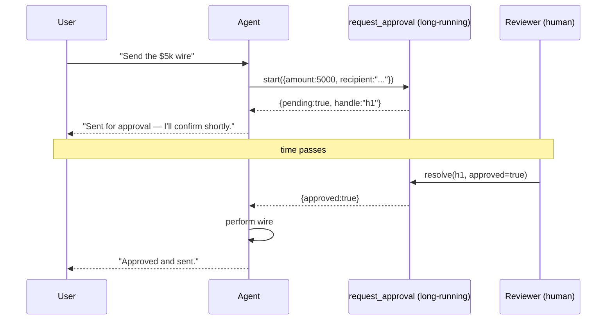

# Approval flows

<span class="kicker">ch 14 · page 2 of 2</span>

Any agent that can take action on someone else's behalf eventually
needs human approval. ADK's `LongRunningFunctionTool` is the
mechanism; this page is the patterns.

---

## The shape



## The tool

```python
from google.adk.tools.long_running_tool import LongRunningFunctionTool
from google.adk.tools.tool_context import ToolContext


def request_approval(description: str, impact: str,
                     tool_context: ToolContext) -> dict:
    """Ask a human to approve a high-impact action.

    Args:
      description: one-line description of the action.
      impact: rough scope ("affects one user", "affects all tenants").
    """
    handle = notify_reviewers(
        session_id=tool_context._invocation_context.session.id,
        description=description, impact=impact)
    tool_context.state["temp:last_handle"] = handle
    return {"pending": True, "handle": handle}


root_agent = LlmAgent(
    name="ops",
    model="gemini-3.1-flash",
    instruction=(
        "Before taking any action that spends money, deletes data, "
        "or touches more than one user, call request_approval with a "
        "one-line description and impact. Only proceed after the "
        "approval returns approved=true."),
    tools=[do_refund, delete_user, request_approval_tool := LongRunningFunctionTool(func=request_approval)],
)
```

## The resume endpoint

A webhook (Slack button, email link, in-app button) resolves the
handle:

```python
@app.post("/approvals/{handle}")
async def resolve_approval(handle: str, body: dict):
    session = lookup_session_by_handle(handle)
    async for _ in runner.resume_tool(
        session_id=session.id,
        user_id=session.user_id,
        handle=handle,
        response={"approved": body["approved"], "note": body.get("note", "")}):
        pass
    return {"ok": True}
```

Authenticate the endpoint. Even on an internal network, sign the
handle with HMAC and verify before resolving.

## Approval as a card, not a modal

In the chat UI, render the pending approval as an inline card with
Approve / Decline buttons. Cards are less interruptive than modals
and let the user scroll away and come back.

Copy guidance: *"Approve and proceed"* / *"Send back with notes"*.
Not *"Confirm"* / *"Cancel"*. The first reads as considered; the
second reads as transactional.

## Timeouts

Every approval should time out. Pair with an `after_agent_callback`
that checks whether the session has an outstanding handle older
than N hours and auto-closes it.

## Escalation

If one reviewer has not acted in N hours, notify a second reviewer.
Persist the escalation chain in the handle record.

---

## See also

- `contributing/samples/human_in_loop`, `human_tool_confirmation`.
- [Chapter 4 — Long-running tools](../04-tools/long-running-tools.md).
