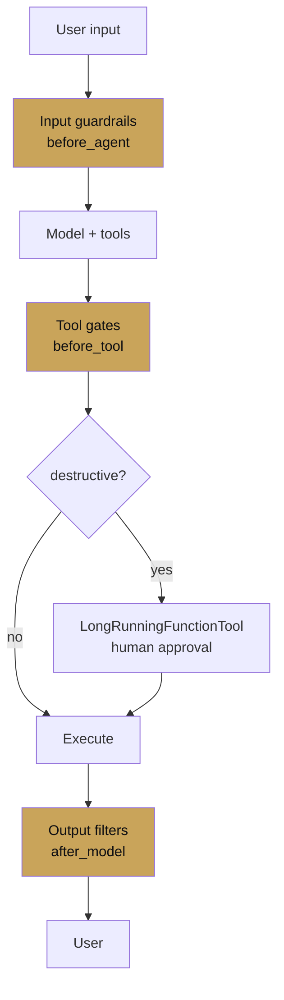

# Chapter 14 — Safety

chapter 14 · guardrails, approvals, red-team

Safety in an agent system is layered. Tool-level gates, callback
policies, approval flows for destructive operations, and evaluation
for regressions. This chapter covers the three layers and how they
compose.

| Page | Covers |
|---|---|
| [Guardrails](guardrails.md) | Input/output filters, content policy, rate limits |
| [Approval flows](approval-flows.md) | Human-in-the-loop for high-stakes actions |
