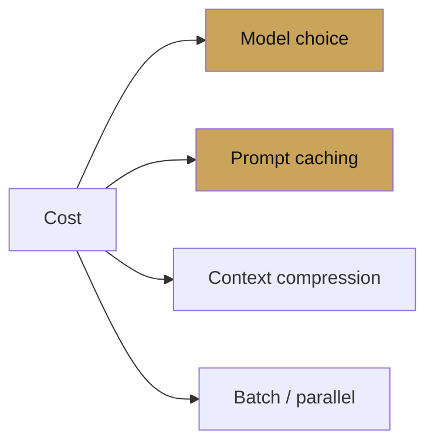

# Chapter 15 — Cost & latency

chapter 15 · what actually costs you money

Four levers: model choice, caching, context compression, and batching.
This chapter ranks them by impact and covers the settings for each.

| Page | Covers |
|---|---|
| [Caching](caching.md) | Prompt caching, tool-result caching |
| [Model routing](model-routing.md) | Pro vs Flash, LiteLLM, fallbacks |
