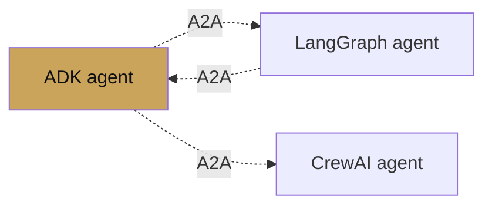

# A2A interop

<span class="kicker">ch 16 · page 2 of 3</span>

The Agent-to-Agent protocol is the open standard for cross-process
agent communication. See
[Chapter 9 — A2A federation](../09-multi-agent/a2a-federation.md)
for consuming remote agents; this page focuses on exposing ADK
agents to non-ADK callers.

---

## Expose an ADK agent as A2A

```bash
adk api_server --a2a --agents agents.support \
  --port 8443 --session_service_url postgres://...
```

The resulting endpoints:

- `GET  /a2a/support/.well-known/agent-card`
- `POST /a2a/support/invoke`
- `POST /a2a/support/stream`

Any A2A-compliant client can call these. LangGraph, CrewAI, and
custom clients all work.

## The agent card

```json
{
  "name": "support",
  "description": "Customer support agent covering billing, tech, returns.",
  "capabilities": {
    "streaming": true,
    "tools": true,
    "longRunning": true,
    "multimodal": false
  },
  "authentication": {"type": "bearer"},
  "endpoints": {
    "invoke": "https://api.example.com/a2a/support/invoke",
    "stream": "https://api.example.com/a2a/support/stream"
  }
}
```

## Framework-agnostic federation



All three sides see the same agent-card + POST endpoint contract.
No framework-specific glue.

## Auth patterns

- Bearer tokens for server-to-server.
- IAP for internal users.
- mTLS inside a private network.

## Failure handling across A2A

Remote agents can time out, rate-limit, or return errors. Wrap the
`RemoteA2aAgent` in an `after_agent_callback` that handles the
error shape you care about.

---

## See also

- `contributing/samples/a2a_basic`, `a2a_auth`, `a2a_human_in_loop`.
- [a2a-protocol.org](https://a2a-protocol.org/).
